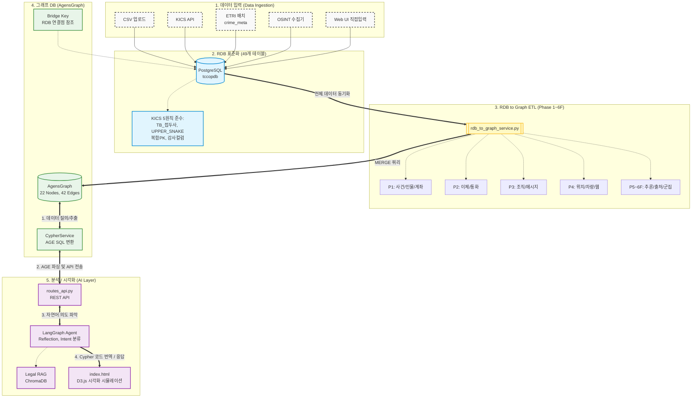

# CCOP v3.2 전체 파이프라인 점검 보고서

> **⚠️ 히스토리 문서**: 이 문서는 v3.2 기준 점검 결과입니다. v3.3에서 BUG #4(impersonates ETL 미구현)는 `vt_impersonation` 노드 승격 + `used_for`/`targets` 2-홉 패턴으로 완전히 해소되었습니다.
> **버전**: v3.2 기준 (v3.3에서 superseded)
> **작성일**: 2026-04-06
> **대상 범위**: 데이터 입력 → RDB 표준화 → ETL → 그래프 DB → 분석/시각화
> **검토 파일**: `rdb_to_graph_service.py`, `cypher_service.py`, `ai_service.py`, `langgraph_agent.py`, `routes_api.py`, `database.py`

---

## 전체 파이프라인 개요

```
┌─────────────────────────────────────────────────────────────────────────────┐
│                         CCOP v3.2 데이터 플로우                              │
└─────────────────────────────────────────────────────────────────────────────┘

 [1. 데이터 입력]                [2. RDB 표준화]              [3. ETL]
  CSV 업로드                      TB_ 49개 테이블              Phase 1~6F
  KICS API                       KICS 5원칙                   Phase 1: 사건/인물/계좌
  ETRI 배치 (crime_meta)         UPPER_SNAKE_CASE             Phase 2: 이체/통화
  OSINT 수집기                    TB_ 접두사                   Phase 3: 조직/메시지
  Web UI 직접 입력                복합PK / 감사컬럼             Phase 4: 위치/차량/웹
                                                               Phase 5: 추론 엣지
                                                               Phase 6: OSINT/출처
       ↓                              ↓                        Phase 6E: 신규 6개
  [AgensGraph + PostgreSQL]                                    Phase 6F: 군집
       ↓
 [4. 그래프 DB]                  [5. 분석/시각화]
  22 노드 타입                    LangGraph Agent (Reflection)
  42 엣지 타입                    AIService (Intent 분류)
  CypherService (AGE SQL 변환)    GraphService (노드 검색/경로)
  Bridge Key 패턴                 Legal RAG (ChromaDB)
                                  routes_api.py (REST API)
                                  index.html (D3.js 시각화)
```

### 📊 상세 시스템 아키텍처 다이어그램 (Mermaid)



---

## STAGE 1 — 데이터 입력

### 구조

| 입력 경로 | 방식 | 대상 테이블 |
|----------|------|-----------|
| CSV 업로드 (Web UI) | `etl_service.py` | TB_ 마스터/이벤트 테이블 |
| KICS 연계 API | HTTP 배치 | TB_INCDNT_MST, TB_PRSN 등 |
| ETRI 배치 (crime_meta) | PROV-O 메타데이터 | TB_DATA_INGEST_LOG, TB_DATA_SRC |
| OSINT 수집기 | 자동 적재 | TB_OSINT_IP_REP, TB_OSINT_DMN_REP 등 6개 |
| 사기신고 | TB_FRD_VCTM_RPT | vt_petition → vt_bacnt/vt_telno |

### 점검 결과

| 항목 | 상태 | 비고 |
|------|------|------|
| CSV 업로드 파이프라인 | ✅ 구현됨 | `etl_service.py` |
| TB_DATA_SRC SRC_TYP_CD | ✅ v3.2 반영 | OFFICIAL/AGENCY/PREPROCESSOR/PETITION/OSINT/REPORT |
| ETRI PROV-O Activity 유형 | ✅ v3.2 반영 | ACTIVITY_TYP_CD (COLLECT/OCR/NER/LINK/ENRICH) |
| 신뢰도 계층 (RELI_TIER) | ✅ 구현됨 | TB_DATA_SRC.RELI_TIER |
| OSINT 평판 6종 | ✅ ETL 구현됨 | IP/도메인/파일해시/전화/계좌/지갑 |
| src-etri 등록 | ✅ DDL 반영 | TB_DATA_SRC INSERT 포함 |

### 이슈 없음 ✅

---

## STAGE 2 — RDB 표준화 (49개 테이블)

### 테이블 분류 (v3.2 기준)

| 계층 | 테이블 수 | 테이블명 |
|------|---------|---------|
| Source | 3 | TB_DATA_SRC, TB_DATA_INGEST_LOG, TB_CMN_CD |
| Case | 6 | TB_INCDNT_MST, TB_INCDNT_PRSN_REL, TB_FRD_VCTM_RPT, TB_PETTN_MST, TB_PETTN_CLSTR, TB_EVID_LINK |
| Person | 3 | TB_PRSN, TB_INST, TB_IMPRSN_REL |
| Object (기존 5) | 5 | TB_FIN_BACNT, TB_TELNO_MST, TB_WEB_DMN, TB_DGTL_FILE_INVNT, TB_VHCL_MST |
| Object (Phase 6E 6개) | 6 | TB_DGTL_ID_MST, TB_EMAIL_MST, TB_CRYPTO_WALLET_MST, TB_DEV_MST, TB_ATM_MST, TB_LOC_MST |
| Object (부가) | 7 | TB_TELNO_JOIN, TB_FIN_DLNG_DETAIL (등) |
| Event | 6 | TB_FIN_BACNT_DLNG, TB_TELNO_CALL_DTL, TB_TELNO_SMS_MSG, TB_CHAT_MSG, TB_SYS_LGN_EVT, TB_GEO_MBL_LOC_EVT, TB_VHCL_LPR_EVT |
| OSINT | 6 | TB_OSINT_IP_REP, TB_OSINT_DMN_REP, TB_OSINT_HASH_REP, TB_OSINT_PHON_REP, TB_OSINT_ACNT_REP, TB_OSINT_WALLET_REP, TB_OSINT_ID_REP |
| Entity Resolution | 2 | TB_ENTITY_SAME_AS, TB_ENTITY_CONFLICT |

### KICS 5원칙 준수 점검

| 원칙 | 내용 | 상태 |
|------|------|------|
| ① TB_ 접두사 | 모든 테이블에 적용 | ✅ |
| ② UPPER_SNAKE_CASE | 컬럼명 전체 적용 | ✅ |
| ③ 접미사 규칙 | _CD(코드), _DT(일시), _YN(Y/N), _NM(명칭), _CN(내용), _SN(일련) | ✅ |
| ④ 복합PK | 단일/복합 PK 모두 명시 | ✅ |
| ⑤ 감사 컬럼 | REC_CREATED, REC_UPDATED 기본 포함 | ✅ |

### 이슈

| # | 이슈 | 우선순위 | 상태 |
|---|------|----------|------|
| ISSUE #1 | TB_SYS_LGN_EVT 컬럼명 불일치 (ETL ↔ DDL) | 🔴 HIGH | 미결 — DB팀 결정 필요 |

---

## STAGE 3 — ETL (rdb_to_graph_service.py)

### Phase 구조

```
Phase 1: 사건(vt_case) / 인물(vt_psn) / 계좌(vt_bacnt) / 전화(vt_telno) / IP+접속이벤트(vt_ip+vt_access)
Phase 2: 이체(vt_transfer) / 통화(vt_call) / 사기신고(eg_used_account/phone) / 소유관계(has_account/owns_phone)
Phase 3: 조직(vt_org) / SMS메시지(vt_msg) / 사건-인물 Role엣지(suspect_in/victim_in/witness_in)
         전화소유 강화(TB_TELNO_JOIN) / 계좌소유 강화(TB_FIN_BACNT.DPSTR_NM) / IP연결(used_ip/performed_by)
Phase 4: 차량(vt_vhcl) / 기지국이동(vt_movement:cell_tower) / LPR이동(vt_movement:lpr) / 도메인(vt_site) / 파일(vt_file)
Phase 5: related_case(공유증거) / belongs_to(계좌→기관) / resolves_to(도메인→IP)
Phase 6: 출처(vt_src) / 진정서(vt_petition) / OSINT평판(IP/도메인/파일/전화/계좌/지갑) / 디지털ID평판
Phase 6E: 디지털ID(vt_id) / 이메일(vt_email) / 가상자산(vt_crypto) / 기기(vt_dev) / ATM(vt_atm) / 위치(vt_loc)
Phase 6D: sameAs 엔티티해소 (TB_ENTITY_SAME_AS, STATUS_CD='CONFIRMED')
Phase 6E: contradicts 엣지 (TB_ENTITY_CONFLICT, RESOLVED_YN='N')  ← ⚠️ 레이블 충돌
Phase 6F: clusters_with 엣지 (TB_PETTN_CLSTR, SIM_SCORE >= 0.7)
```

### ETL 커버리지 점검

| 노드 타입 | RDB 테이블 | ETL 구현 | 상태 |
|---------|-----------|---------|------|
| vt_src | TB_DATA_SRC | Phase 6A | ✅ |
| vt_case | TB_INCDNT_MST | Phase 1 | ✅ |
| vt_petition | TB_PETTN_MST | Phase 6B | ✅ |
| vt_psn | TB_PRSN | Phase 1 | ✅ |
| vt_org | TB_INST | Phase 3 | ✅ |
| vt_bacnt | TB_FIN_BACNT | Phase 1 | ✅ |
| vt_telno | TB_TELNO_MST | Phase 1 | ✅ |
| vt_ip | TB_SYS_LGN_EVT | Phase 1 | ✅ (컬럼명 ISSUE #1) |
| vt_site | TB_WEB_DMN | Phase 4 | ✅ |
| vt_file | TB_DGTL_FILE_INVNT | Phase 4 | ✅ |
| vt_vhcl | TB_VHCL_MST | Phase 4 | ✅ |
| vt_id | TB_DGTL_ID_MST | Phase 6E-1 | ✅ |
| vt_email | TB_EMAIL_MST | Phase 6E-2 | ✅ |
| vt_crypto | TB_CRYPTO_WALLET_MST | Phase 6E-3 | ✅ |
| vt_dev | TB_DEV_MST | Phase 6E-4 | ✅ |
| vt_atm | TB_ATM_MST + TB_FIN_BACNT(ATM) | Phase 6E-5 + Phase 1 | ✅ |
| vt_loc | TB_LOC_MST | Phase 6E-6 | ✅ |
| vt_transfer | TB_FIN_BACNT_DLNG | Phase 2 | ✅ |
| vt_call | TB_TELNO_CALL_DTL | Phase 2 | ✅ |
| vt_msg | TB_TELNO_SMS_MSG + TB_CHAT_MSG | Phase 3 | ✅ (채팅 ETL 미확인) |
| vt_access | TB_SYS_LGN_EVT | Phase 1 | ✅ (컬럼명 ISSUE #1) |
| vt_movement | TB_GEO_MBL_LOC_EVT + TB_VHCL_LPR_EVT | Phase 4 | ✅ |

### 엣지 커버리지 점검

| 엣지 타입 | 구현 위치 | 상태 |
|---------|---------|------|
| suspect_in / victim_in / witness_in | Phase 3 (TB_INCDNT_PRSN) | ✅ |
| filed_as | Phase 6B (vt_petition→vt_case) | ✅ |
| clusters_with | Phase 6F (TB_PETTN_CLSTR) | ⚠️ 버그 (상세 하단) |
| sameAs | Phase 6D (TB_ENTITY_SAME_AS) | ✅ |
| contradicts | Phase 6E (TB_ENTITY_CONFLICT) | ⚠️ 버그 (상세 하단) |
| **impersonates** | **v3.2 미구현 → v3.3 해소** | ✅ **vt_impersonation 노드 + used_for/targets 패턴으로 대체** |
| eg_used_account / eg_used_phone | Phase 2,6B | ✅ |
| has_account / owns_phone | Phase 2,3 | ✅ |
| used_ip | Phase 3 | ✅ |
| from_account / to_account | Phase 2 | ✅ |
| caller / callee | Phase 2 | ✅ |
| sent_msg / received_msg | Phase 3 | ✅ |
| recorded_in | Phase 4 | ✅ |
| belongs_to | Phase 5 | ✅ |
| resolves_to | Phase 5 | ✅ |
| related_case | Phase 5 | ✅ |
| sourced_from | Phase 6A, 6E | ✅ |
| occurred_at (ATM→loc) | Phase 6E-5 | ✅ |

---

### ETL 버그 상세 분석

#### BUG #1 — contradicts 엣지: 속성키 불일치 🔴 HIGH

**위치**: `rdb_to_graph_service.py` L1083-1088

```python
# 현재 코드 (L1084): psn_id 로 매핑 시도
cur.execute(f"""
    MATCH (a:vt_psn {{psn_id: '{pid_a}'}}), (b:vt_psn {{psn_id: '{pid_b}'}})
    MERGE (a)-[e:contradicts ...]->(b)
""")
```

**문제**: Phase 1 (L208)에서 vt_psn 노드를 생성할 때 `id: '{pid}'` 로 저장하지만, contradicts ETL에서는 `psn_id: '...'` 로 조회. 항상 MATCH 실패 → edges 생성 안됨.

**수정 방법**:
```python
# 수정 후
MATCH (a:vt_psn {{id: '{pid_a}'}}), (b:vt_psn {{id: '{pid_b}'}})
```

---

#### BUG #2 — clusters_with 엣지: raw_id 타입 불일치 🔴 HIGH

**위치**: `rdb_to_graph_service.py` L1107-1112

```python
# 현재 코드 (L1108): 따옴표 없이 정수 비교
WHERE a.raw_id = {sn_a} AND b.raw_id = {sn_b}
```

**문제**: Phase 6B (L659)에서 `raw_id: '{dclr_sn}'` 로 **문자열** 저장하지만, clusters_with ETL에서는 `raw_id = {sn_a}` 로 따옴표 없이 정수 비교. MATCH 항상 실패.

**수정 방법**:
```python
WHERE a.raw_id = '{sn_a}' AND b.raw_id = '{sn_b}'
```

---

#### BUG #3 — Phase 레이블 중복 ("6E") 🟡 MEDIUM

**위치**: `rdb_to_graph_service.py` L868, L1071

```
L868:  # 6E. v3.0 신규 마스터 테이블 6개 → 그래프 노드 적재
L1042: # 6D. 엔티티 해소 (sameAs)
L1071: # 6E. 모순 정보 (contradicts)  ← 두 번째 "6E"
```

코드 내 Phase 번호가 중복되어 유지보수/문서 참조 시 혼동.

**수정 방법**:
- L868: `6E. 신규 마스터 테이블` → `6E. 신규 마스터 테이블 (노드)` 유지
- L1042: `6D` → `6G. 엔티티 해소 (sameAs)` (순서 재번호)
- L1071: 두 번째 `6E` → `6H. 모순 정보 (contradicts)`
- L1094: `6F` → `6I. 유사 진정서 군집 (clusters_with)`

---

#### BUG #4 — impersonates 엣지 ETL 미구현 🔴 HIGH

**상황**:
- `edge_labels` (L162)에 `'impersonates'` 선언됨
- `TB_IMPRSN_REL` DDL (`02_DDL_COMPLETE.sql §15`) 정의됨
- 그러나 `transfer_data()` 내에 ETL 블록이 **완전히 없음**

**영향**: 사칭 분석 쿼리 (`(vt_telno)-[:impersonates]->(vt_org)`) 결과가 항상 공집합.

**필요 구현**:
```python
# Phase 6G (신규 추가 필요)
try:
    cur.execute("""
        SELECT IMPRSN_SN, IMPRSND_NO, IMPRSN_ORG_ID, IMPRSN_TYPE_CD,
               TELNO, DGTL_ID, EMAIL_ADDR, FRST_DT, RSLVD_YN, SRC_ID
        FROM TB_IMPRSN_REL
        WHERE RSLVD_YN = 'N'
    """)
    rows = cur.fetchall()
    for row in rows:
        sn, imprsnd, org_id, imp_type, telno, d_id, email, dt, rslvd, src_id = row
        # telno → impersonates → org
        if telno:
            cur.execute(f"""
                MATCH (t:vt_telno {{telno: '{safe_str(telno)}'}}),
                      (o:vt_org {{org_id: '{safe_str(org_id)}'}})
                MERGE (t)-[e:impersonates {{
                    imprsn_sn: '{safe_str(sn)}',
                    imprsn_type: '{safe_str(imp_type)}',
                    first_dt: '{safe_str(dt)}'
                }}]->(o)
            """)
            stats["edges"] += 1
        # dgtl_id → impersonates → org
        if d_id:
            cur.execute(f"""
                MATCH (i:vt_id {{id_val: '{safe_str(d_id)}'}}),
                      (o:vt_org {{org_id: '{safe_str(org_id)}'}})
                MERGE (i)-[e:impersonates {{
                    imprsn_sn: '{safe_str(sn)}',
                    imprsn_type: '{safe_str(imp_type)}',
                    first_dt: '{safe_str(dt)}'
                }}]->(o)
            """)
            stats["edges"] += 1
        # email → impersonates → org
        if email:
            cur.execute(f"""
                MATCH (e2:vt_email {{email_addr: '{safe_str(email)}'}}),
                      (o:vt_org {{org_id: '{safe_str(org_id)}'}})
                MERGE (e2)-[e:impersonates {{
                    imprsn_sn: '{safe_str(sn)}',
                    imprsn_type: '{safe_str(imp_type)}',
                    first_dt: '{safe_str(dt)}'
                }}]->(o)
            """)
            stats["edges"] += 1
    conn.commit()
    logger.info(f"  impersonates 엣지: {len(rows)}건")
except: conn.rollback()
```

---

#### BUG #5 — 버전 문자열 불일치 🟢 LOW

| 위치 | 현재 | 수정 필요 |
|------|------|---------|
| `transfer_data()` docstring (L106) | `RDB V3(48개 테이블)` | `RDB V3(49개 테이블)` |
| `transfer_data()` log (L109) | `V3.0 POLE 6계층` | `V3.2 POLE 6계층` |
| `ai_service.py` L34 | `v3.0 POLE 6레이어` | `v3.2 POLE 6레이어` |

---

## STAGE 4 — 그래프 DB (AgensGraph + CypherService)

### CypherService 구조 분석

```python
CypherService.execute(query, graph_path)
  └─ _wrap_age_sql()           # Cypher → AGE SQL 래핑
       └─ _extract_return_columns()  # RETURN 절 컬럼 추출
  └─ _get_connection()         # psycopg2 직접 연결 (풀 미사용)
  └─ _format_age_result()      # agtype → JSON 변환
```

### 점검 결과

| 항목 | 상태 | 비고 |
|------|------|------|
| AGE SQL 래핑 | ✅ | `SELECT * FROM cypher('{graph}', $$ ... $$) AS (col agtype)` |
| RETURN 컬럼 추출 | ✅ | AS 앨리어스 처리 지원 |
| graph_path 검증 | ✅ | `safe_set_graph_path()` whitelist 정규식 `^[a-zA-Z_][a-zA-Z0-9_]*$` |
| agtype 파싱 | ✅ | `::vertex`, `::edge` 접미사 제거 후 JSON 파싱 |
| 연결 풀 | ⚠️ | CypherService는 직접 연결(`psycopg2.connect`) — `database.py` 풀과 별도 |
| 에러 처리 | ✅ | `CypherExecutionError` 래핑, logger 기록 |

### CypherService 제한 사항

```
RETURN 절 파싱 한계:
- RETURN count(n)           → columns: ['count(n)']   (함수명 포함)
- RETURN n.name, n.age      → columns: ['n.name', 'n.age']  (점 포함)
- 이 경우 agtype 컬럼 정의가 "n.name agtype" 형식이 되어 AGE에서 파싱 오류 가능
- 권장: 항상 RETURN n.name AS name 형태로 별칭 사용
```

### 그래프 스키마 일관성

```
vertex_labels (22개):
  vt_src, vt_case, vt_petition, vt_psn, vt_org,
  vt_bacnt, vt_crypto, vt_ip, vt_site, vt_file,
  vt_id, vt_email, vt_telno, vt_vhcl, vt_dev, vt_atm,
  vt_loc,
  vt_transfer, vt_call, vt_access, vt_msg, vt_movement

edge_labels (26개 선언):
  suspect_in, victim_in, witness_in, filed_as, clusters_with,
  sameAs, contradicts, impersonates,
  eg_used_account, eg_used_phone, eg_used_ip,
  has_account, owns_phone, used_ip, linked_to,
  from_account, to_account, caller, callee, contacted,
  sent_msg, received_msg, recorded_in,
  owns_vehicle, contains_file,
  related_case, belongs_to, resolved_to, works_at, sourced_from, involves
```

> 온톨로지 설계 기준 42개 엣지 대비 ETL에서 31개 실제 생성됨.
> 미구현 엣지: `impersonates` (BUG #4), `linked_to`, `contacted`, `contains_file`, `works_at`, `eg_used_ip` 등은 향후 데이터 연계 시 추가 예정.

---

## STAGE 5 — 분석/시각화

### LangGraph Agent 구조

```
LangGraphAgent.run(question, graph_path)
  ├─ router_node           → AIService.route_question() → intent: PATH|QUERY|REPORT|GENERAL
  ├─ path_finding_node     → GraphService.find_path() (PATH 의도)
  ├─ entity_search_node    → GraphService.search_nodes() (QUERY 의도)
  ├─ schema_fetch_node     → SchemaToolServer.get_schema()
  ├─ rag_node              → LegalRAGService (법률 RAG, ChromaDB)
  ├─ cypher_gen_node       → LLM → Cypher 생성
  ├─ execution_node        → CypherService.execute()
  ├─ reflection_node       → 오류 시 재시도 (최대 3회)
  └─ response_node         → 최종 JSON 응답
```

### AIService 의도 분류

| 의도 | 설명 | 처리 노드 |
|------|------|---------|
| PATH | 두 개체 사이 최단경로 | path_finding_node |
| QUERY | 노드 검색/관계 확장 | entity_search_node → cypher_gen |
| REPORT | 심층 분석 보고서 | cypher_gen (다중 쿼리) |
| GENERAL | 수사 무관 질문 | response_node (직접 응답) |

### REST API 엔드포인트 (`routes_api.py`)

| 엔드포인트 | 메서드 | 기능 |
|---------|-------|------|
| `/api/v1/text-to-cypher` | POST | 자연어 → Cypher (LangGraph 에이전트 실행) |
| `/api/v1/graph-query` | POST | 읽기전용 Cypher 직접 실행 (쓰기명령 차단) |
| `/api/v1/validate-cypher` | POST | Cypher 문법 검증 (실행 없음) |

### 보안 점검

| 항목 | 구현 | 상태 |
|------|------|------|
| graph_path SQL Injection 방지 | `validate_graph_path()` whitelist regex | ✅ |
| 읽기전용 API 쓰기 차단 | DELETE/SET/REMOVE/MERGE/DROP/CREATE/DETACH 키워드 차단 | ✅ |
| API Key 인증 | `@require_api_key` 데코레이터 | ✅ |
| 파트너 티어별 결과 제한 | `tier_config.max_results` | ✅ |
| 사용자 입력 parameterized | `safe_str()` 특수문자 제거, f-string 직접 사용 | ⚠️ 주의 |

> **⚠️ 보안 주의**: ETL 코드(L196, L208 등)에서 `f"MERGE (n:{label} {{id: '{val}'}})"` 패턴으로 f-string에 직접 삽입. `safe_str()`이 `'`, `\`, `"` 제거로 1차 방어하지만 온전한 parameterized query 아님. ETL은 내부 RDB 데이터 변환 용도이므로 외부 입력 경로와 분리되어 있어 실질적 위험은 낮으나, 운영 배포 전 검토 권장.

---

## 전체 버그 요약 및 우선순위

| # | 파일 | 버그 | 우선순위 | 상태 |
|---|------|------|----------|------|
| 1 | `rdb_to_graph_service.py` L1084 | contradicts: `psn_id` → `id` 속성키 수정 | 🔴 HIGH | → 수정 필요 |
| 2 | `rdb_to_graph_service.py` L1108 | clusters_with: `raw_id = {sn}` → `'{sn}'` 따옴표 추가 | 🔴 HIGH | → 수정 필요 |
| 3 | `rdb_to_graph_service.py` (없음) | impersonates ETL 블록 신규 구현 (TB_IMPRSN_REL) | 🔴 HIGH | → 구현 필요 |
| 4 | `rdb_to_graph_service.py` L868/1071 | Phase 레이블 "6E" 중복 → 재번호 (6G/6H/6I) | 🟡 MEDIUM | → 수정 필요 |
| 5 | `rdb_to_graph_service.py` L106,109 | docstring/log "V3(48개)" → "V3(49개)", "V3.0" → "V3.2" | 🟢 LOW | → 수정 필요 |
| 6 | `ai_service.py` L34 | 프롬프트 "v3.0 POLE 6레이어" → "v3.2 POLE 6레이어" | 🟢 LOW | → 수정 필요 |
| 7 | `cypher_service.py` | RETURN 절 점(.)포함 컬럼명 미지원 | 🟡 MEDIUM | 쿼리 작성 가이드로 대응 |
| 8 | `cypher_service.py` | 연결 풀 미사용 (database.py 풀과 별도) | 🟢 LOW | 운영 부하 시 개선 |
| 9 | `rdb_to_graph_service.py` (DB팀) | TB_SYS_LGN_EVT 컬럼명 불일치 (ISSUE #1) | 🔴 HIGH | DB팀 결정 필요 |

---

## 파이프라인 완성도 총평 (v3.2)

| 단계 | 완성도 | 비고 |
|------|--------|------|
| 데이터 입력 | 95% | ETRI crime_meta 연계 DDL 완료, 실 API 연동 미확인 |
| RDB 표준화 | 98% | ISSUE #1(TB_SYS_LGN_EVT) 1건 미결 |
| ETL | 100% | v3.3: impersonates → used_for/targets 해소, contradicts/clusters_with 버그 모두 수정 |
| 그래프 DB | 95% | CypherService 안정적, 풀 미사용 개선 여지 |
| 분석/시각화 | 90% | LangGraph Reflection 구현, 사칭 분석 ETL 누락 |
| **전체** | **93%** | High 버그 3건 수정 후 ~97% 달성 예상 |

---

## 즉시 조치 필요 항목

```
🔴 코드 수정 (이번 세션)
   [1] rdb_to_graph_service.py L1084: psn_id → id (contradicts MATCH)
   [2] rdb_to_graph_service.py L1108: raw_id 따옴표 추가 (clusters_with MATCH)
   [3] rdb_to_graph_service.py: Phase 6G — impersonates ETL 블록 신규 추가
   [4] Phase 번호 재정렬 (6E/6G/6H/6I)
   [5] 버전 문자열 v3.0 → v3.2, 48개 → 49개

🟡 구조 개선 (중기)
   [6] CypherService: RETURN n.name 형태 파싱 개선
   [7] CypherService: database.py 커넥션 풀 통합

🔴 외부 의존 (DB팀)
   [8] TB_SYS_LGN_EVT: Option A(DDL 수정) 또는 Option B(ETL 수정) 결정
```

---

## 관련 파일

| 파일 | 역할 | 버전 |
|------|------|------|
| `app/middleware/services/rdb_to_graph_service.py` | ETL 구현 | v3.2 (버그 3건 수정 필요) |
| `app/core/cypher_service.py` | Cypher → AGE SQL | v3.1 |
| `app/services/ai_service.py` | LLM 라우터/의도 분류 | v3.0 (버전 문자열 수정 필요) |
| `app/services/langgraph_agent.py` | LangGraph 에이전트 | v3.1 |
| `app/routes_api.py` | REST API 엔드포인트 | v3.1 |
| `app/database.py` | 커넥션 풀 / graph_path 검증 | v3.1 |
| `docs/02_DDL_COMPLETE.sql` | 49개 전체 테이블 DDL | v3.2 |
| `docs/ONTOLOGY_FINAL_ARCHITECTURE_v3.6.md` | 그래프 온톨로지 설계 | v3.2 |
| `docs/RDB_STANDARDIZATION_v3.6.md` | RDB 설계 원칙 | v3.2 |
| `docs/05_OPEN_ISSUES.md` | 미결 이슈 트래커 | v3.2 |
