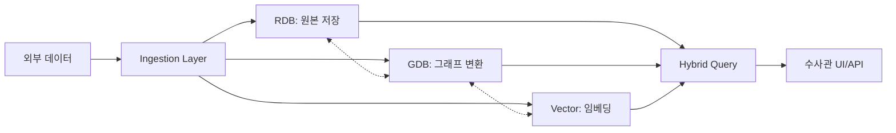

# CCOP 통합 기술 설계서 (Technical Design Document)

> **Version**: 1.0  
> **Date**: 2026-01-29  
> **Scope**: 아키텍처, 데이터 플로우, 표준화, 스키마, 엔티티, 엣지

---

## 1. 아키텍처 개요 (Architecture Overview)

### 1.1 One-Instance Multi-Model 전략

PostgreSQL 생태계 내에서 **RDB + GDB + Vector**를 단일 인스턴스로 운영하는 Zero-Latency 아키텍처입니다.

```
┌─────────────────────────────────────────────────────────────┐
│              PostgreSQL 14+ (Single Instance)               │
├─────────────┬─────────────────────┬─────────────────────────┤
│  RDB        │  GDB (AgensGraph)   │  Vector (pgvector)      │
│  원천 데이터  │  관계 분석          │  의미 검색              │
│  KICS 표준   │  4-Layer 온톨로지   │  Embedding 1536dim     │
└─────────────┴─────────────────────┴─────────────────────────┘
```

### 1.2 4-Layer 논리 아키텍처

| Layer | 역할 | 구성 요소 |
|-------|------|----------|
| **L1: Ingestion** | 수집/변환 | Graphizer (ETL), Embedding Engine |
| **L2: Storage** | 저장 | RDB + GDB + Vector |
| **L3: Intelligence** | 추론/질의 | Hybrid Query, Text-to-Cypher |
| **L4: Service** | 활용 | REST API, Visualization |

---

## 2. 데이터 플로우 (Data Flow)

### 2.1 전체 흐름



### 2.2 단계별 설명

| 단계 | 입력 | 처리 | 출력 |
|------|------|------|------|
| **수집** | CSV, KICS Export, PDF | 파싱/정제 | 정형 데이터 |
| **RDB 적재** | 정형 데이터 | INSERT | `case_info`, `person` 레코드 |
| **GDB 변환** | RDB 레코드 | Graphizer | `(:vt_case)-[:involves]->(:vt_psn)` |
| **Vector 변환** | 텍스트(조서) | sLLM Embedding | 1536차원 벡터 |
| **질의** | 자연어/Cypher | Hybrid Query | 통합 결과셋 |

---

## 3. 실제 업무 적용 방안 (Use Cases)

### 3.1 보이스피싱 수사 시나리오

**수사관 질문**: "이 대포통장과 연결된 모든 용의자와 통화 기록을 찾아줘"

**시스템 처리**:
1. **RDB**: 대포통장 기본 정보 조회
2. **GDB**: `(계좌)-[:controlled_by]->(인물)-[:performed]->(통화)` 패턴 탐색
3. **Vector**: 관련 인물 조서에서 "지시", "인출" 키워드 유사 검색
4. **결과**: 용의자 3명 + 통화 127건 + 관련 조서 5건

### 3.2 자금세탁 자동 탐지

- 3단계 이상 계좌 이체 자동 탐지
- 10분 내 이체→ATM인출 패턴 알림
- 동일 전화번호 3건 이상 사건 사용 시 조직범죄 플래그

---

## 4. 표준화 전략 (Standardization)

### 4.1 이중 표준 전략

| 구분 | 표준 | 적용 대상 |
|------|------|----------|
| **데이터 명명** | KICS | 테이블명, 컬럼명, 라벨명 |
| **메타데이터** | CASE/UCO | 국제 호환 매핑 (선택) |

### 4.2 KICS 명명 규칙

- **4자 이하 약어**: `nm`(name), `dt`(date), `cd`(code), `no`(number)
- **접두어**: `vt_`(Vertex Table), 테이블은 접두어 없음
- **코드 테이블**: `code_group` → `common_code` (2단 구조)

### 4.3 CASE/UCO 매핑 (선택적)

```python
'BankAccount': {
    'label': 'vt_bacnt',  # KICS
    'case_class': 'uco-observable:AccountFacet'  # CASE 매핑
}
```

---

## 5. 스키마 정의 (Schema)

### 5.1 RDB 핵심 테이블

| 테이블 | 설명 | 주요 컬럼 |
|--------|------|----------|
| `case_info` | 사건 | `id`, `flnm`, `rcpt_no`, `crm_cd` |
| `person` | 인물 | `id`, `nm`, `rrn`, `role_cd` |
| `evidence` | 증거 | `id`, `case_id`, `evd_tp_cd`, `evd_val` |

### 5.2 GDB 그래프 구조

- **Graph Name**: `investigation_graph`
- **연결 키**: 모든 노드에 `rdb_id` 포함 (RDB JOIN용)

### 5.3 Vector 테이블

| 컬럼 | 타입 | 설명 |
|------|------|------|
| `target_table` | VARCHAR | 원본 테이블명 |
| `target_id` | BIGINT | RDB PK |
| `embedding` | VECTOR(1536) | 임베딩 벡터 |
| `graph_node_id` | VARCHAR | GDB 노드 ID |

---

## 6. 엔티티 정의 (16종)

### 6.1 Layer별 엔티티

| Layer | Entity | Label | 한글 | 법적 분류 |
|-------|--------|-------|------|----------|
| **Case** | Case | `vt_case` | 사건 | 수사사건 |
| | Investigation | `vt_inv` | 수사 | 수사정보 |
| **Actor** | Person | `vt_psn` | 인물 | 피의자정보 |
| | Organization | `vt_org` | 조직 | 피의자정보 |
| | Device | `vt_dev` | 기기 | 디지털증거 |
| **Action** | Transfer | `vt_fin_tx` | 이체 | 금융거래정보 |
| | Call | `vt_comm_rec` | 통화 | 통신사실확인자료 |
| | Access | `vt_net_log` | 접속 | 통신자료 |
| | Message | `vt_comm_msg` | 메시지 | 통신사실확인자료 |
| **Evidence** | BankAccount | `vt_bacnt` | 계좌 | 금융거래정보 |
| | CryptoWallet | `vt_vass` | 가상자산 | 가상자산정보 |
| | Phone | `vt_telno` | 전화 | 통신사실확인자료 |
| | NetworkTrace | `vt_ip` | IP | 통신자료 |
| | WebTrace | `vt_site` | 사이트 | 인터넷기록 |
| | FileTrace | `vt_file` | 파일 | 디지털증거 |
| | Location | `vt_loc` | 위치 | 위치정보 |

---

## 7. 엣지(관계) 정의

### 7.1 핵심 관계

| 관계 타입 | Domain → Range | 의미 | 추론용 |
|----------|----------------|------|--------|
| `performed` | Person → Action | 행위 수행 | - |
| `involves` | Case → Person | 연루 | - |
| `from_account` | Transfer → Account | 출금 | - |
| `to_account` | Transfer → Account | 입금 | - |
| `caller` | Call → Phone | 발신 | - |
| `callee` | Call → Phone | 수신 | - |
| `controls` | Person → Account | 실지배 | transitive |
| `accomplice_of` | Person → Person | 공범 | inferred |

### 7.2 추론 규칙

| 규칙명 | 패턴 | 임계값 | 신뢰도 |
|--------|------|--------|--------|
| OrganizedCrime | 동일 리소스 3회+ 사용 | 3건 | 80% |
| MoneyLaundering | 3단계+ 이체 | 3hop | 75% |
| RapidCashOut | 이체→ATM 10분내 | 10min | 80% |

---

## 8. 참고 문서

| 문서 | 설명 |
|------|------|
| [DATABASE_ARCHITECTURE.md](./DATABASE_ARCHITECTURE.md) | 상세 아키텍처 |
| [ONTOLOGY_GUIDE.md](./ONTOLOGY_GUIDE.md) | 온톨로지 가이드 |
| [RDB_STANDARDIZATION.md](./RDB_STANDARDIZATION.md) | RDB 표준화 |
| [init.sql](../scripts/init.sql) | 통합 스키마 |
