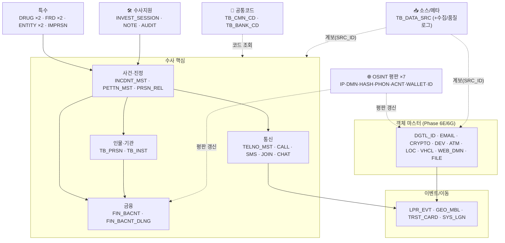
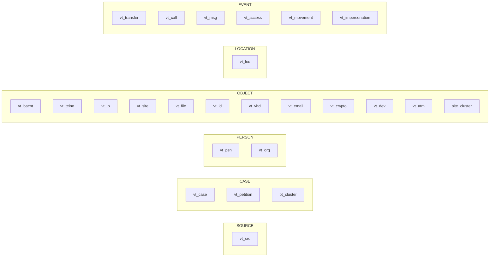
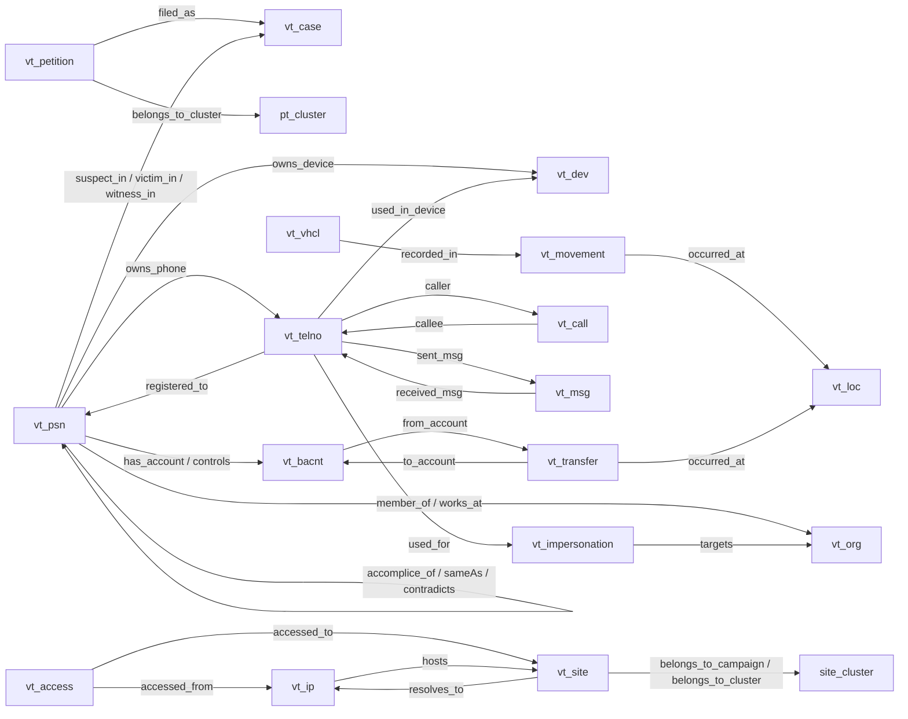

# CCOP 데이터 모델 ERD — 내부 설계 검토

> 관계형 **RDB**(적재/원천, 52테이블)와 **그래프 온톨로지**(분석/시각화, 25노드·53엣지) 두 계층의 ERD.
> 소스: `docs/02_DDL_COMPLETE.sql`(RDB) · `docs/ONTOLOGY_FINAL_ARCHITECTURE_v3.7.md`(그래프).
> 용도: 내부 설계 검토. Mermaid는 GitHub/VS Code/Obsidian에서 렌더된다.

---

## 0. 두 계층 관계 (한눈에)

```
[원천/기관/OSINT]  →  RDB(L2 표준 테이블 52개, 논리 관계)  →  ETL  →  그래프(온톨로지 25/53)  →  시각화·수사분석
```
- **RDB**: 적재·정규화·감사의 단일 진실. 명시적 FK는 최소화(3건)하고 **표준 식별자 컬럼**으로 논리 연결.
- **그래프**: RDB 마스터/이벤트를 노드·엣지로 투영(§C 매핑). 역할·관계를 엣지로 표현.

---

# A. 관계형 RDB ERD

## A.1 도메인 조감도



> **허브 2개는 선을 개별로 긋지 않음**(52개 전부 참조 → 그래프 오염). 점선 그룹으로만 표기:
> - `TB_DATA_SRC(SRC_ID)` — 거의 **모든** 마스터·이벤트·OSINT 테이블이 `SRC_ID`로 출처/신뢰등급 참조
> - `TB_CMN_CD(CD_GRP_ID+CD_VAL)` — 다수 `*_CD` 컬럼의 코드 조회처

## A.2 핵심 도메인 상세 ERD (사건·인물·금융·통신·엔티티)

```mermaid
erDiagram
  TB_INCDNT_MST     ||--o{ TB_INCDNT_PRSN_REL : "연루(역할)"
  TB_PRSN           ||--o{ TB_INCDNT_PRSN_REL : "연루"
  TB_PETTN_MST      }o--o| TB_INCDNT_MST      : "filed_as(LINKED_INCDNT_NO)"
  TB_PETTN_MST      ||--o{ TB_PETTN_CLSTR     : "유사군집(A,B)"
  TB_PETTN_MST      ||--o{ TB_PETTN_PROC_LOG  : "상태이력"
  TB_INST           ||--o{ TB_FIN_BACNT       : "개설기관(INST_ID)"
  TB_BANK_CD        ||--o{ TB_FIN_BACNT       : "은행(BANK_CD)"
  TB_FIN_BACNT      ||--o{ TB_FIN_BACNT_DLNG  : "소유계좌(BACNT_NO,BANK_CD)"
  TB_FIN_BACNT      ||--o{ TB_FIN_BACNT_DLNG  : "상대계좌(RLT_*)"
  TB_ATM_MST        ||--o{ TB_FIN_BACNT_DLNG  : "출금ATM(ATM_MNG_NO)"
  TB_TELNO_MST      ||--o{ TB_TELNO_CALL_DTL  : "발/착신"
  TB_TELNO_MST      ||--o{ TB_TELNO_SMS_MSG   : "SMS 발/착신"
  TB_TELNO_MST      ||--o{ TB_TELNO_JOIN      : "가입"
  TB_PRSN           ||--o{ TB_ENTITY_SAME_AS  : "동일인(A,B)"
  TB_PRSN           ||--o{ TB_ENTITY_CONFLICT : "충돌(A,B)"
  TB_INST           ||--o{ TB_IMPRSN_REL      : "피사칭(TGT_INST_ID)"
  TB_INCDNT_MST     ||--o{ TB_INVEST_SESSION  : "FK 세션"
  TB_INVEST_SESSION ||--o{ TB_INVEST_NOTE     : "FK 메모"

  TB_INCDNT_MST { varchar INCDNT_NO PK; varchar INCDNT_TYP_CD; varchar SRC_ID }
  TB_INCDNT_PRSN_REL { bigint REL_SN PK; varchar INCDNT_NO FK; varchar PRSN_ID FK; varchar ROLE_CD }
  TB_PETTN_MST { bigint DCLR_SN PK; varchar PETITION_ID UK; varchar LINKED_INCDNT_NO; varchar CRIME_TYP_CD }
  TB_PETTN_CLSTR { bigint CLSTR_SN PK; bigint PETTN_SN_A; bigint PETTN_SN_B }
  TB_PETTN_PROC_LOG { bigint LOG_SN PK; bigint PETTN_SN }
  TB_PRSN { varchar PRSN_ID PK; varchar SRC_ID }
  TB_INST { varchar INST_ID PK; varchar BANK_CD; varchar INST_SE_CD }
  TB_FIN_BACNT { varchar BACNT_NO PK; varchar BANK_CD PK; varchar INST_ID; varchar SRC_ID }
  TB_FIN_BACNT_DLNG { bigint DLNG_SN PK; varchar BACNT_NO FK; varchar BANK_CD FK; varchar RLT_BACNT_NO; varchar ATM_MNG_NO }
  TB_TELNO_MST { varchar TELNO PK; varchar SRC_ID }
  TB_TELNO_CALL_DTL { bigint CALL_SN PK; varchar DSPTCH_TELNO FK; varchar RCPTN_TELNO FK }
  TB_TELNO_SMS_MSG { bigint MSG_SN PK; varchar DSPTCH_TELNO FK; varchar RCPTN_TELNO FK }
  TB_TELNO_JOIN { bigint JOIN_SN PK; varchar TELNO FK }
  TB_ATM_MST { varchar ATM_MNG_NO PK; varchar BANK_CD }
  TB_ENTITY_SAME_AS { bigint MATCH_SN PK; varchar PRSN_ID_A FK; varchar PRSN_ID_B FK }
  TB_ENTITY_CONFLICT { bigint CNFL_SN PK; varchar PRSN_ID_A FK; varchar PRSN_ID_B FK }
  TB_IMPRSN_REL { bigint IMPRSN_SN PK; varchar SRC_ENTTY_KEY; varchar TGT_INST_ID }
  TB_INVEST_SESSION { varchar SESSION_ID PK; varchar INCDNT_NO FK }
  TB_INVEST_NOTE { varchar NOTE_ID PK; varchar SESSION_ID FK; varchar INCDNT_NO FK }
```

> ⚠️ **인물↔계좌 직접 FK는 RDB에 없다.** 계좌 소유(그래프 `has_account`)는 ETL 단계에서 예금주명·명의 매칭으로 생성된다(§C). RDB `TB_FIN_BACNT`에는 `PRSN_ID` 컬럼이 없음.

## A.3 전체 테이블 카탈로그 (52개)

| 도메인 | 테이블(개수) |
|--------|-------------|
| 공통코드/참조 (2) | `TB_CMN_CD`, `TB_BANK_CD` |
| 소스/메타 (3) | `TB_DATA_SRC`, `TB_DATA_INGEST_LOG`, `TB_DATA_QUALITY_LOG` |
| 사건/관리 (2) | `TB_INCDNT_MST`, `TB_INCDNT_PRSN_REL` |
| 진정서 (3) | `TB_PETTN_MST`, `TB_PETTN_CLSTR`, `TB_PETTN_PROC_LOG` |
| 인물/기관 (2) | `TB_PRSN`, `TB_INST` |
| 금융 (2) | `TB_FIN_BACNT`, `TB_FIN_BACNT_DLNG` |
| 통신 (5) | `TB_TELNO_MST`, `TB_TELNO_CALL_DTL`, `TB_TELNO_SMS_MSG`, `TB_TELNO_JOIN`, `TB_CHAT_MSG` |
| 차량/이동 (2) | `TB_VHCL_MST`, `TB_VHCL_LPR_EVT` |
| 위치/지리 (2) | `TB_GEO_MBL_LOC_EVT`, `TB_GEO_TRST_CARD_TRIP` |
| 웹/디지털 (4) | `TB_WEB_DMN`, `TB_WEB_MLGN_IDC`, `TB_SYS_LGN_EVT`, `TB_DGTL_FILE_INVNT` |
| OSINT 평판 (7) | `TB_OSINT_IP_REP`, `_DMN_REP`, `_HASH_REP`, `_PHON_REP`, `_ACNT_REP`, `_WALLET_REP`, `_ID_REP` |
| 마약 (2) | `TB_DRUG_SLANG`, `TB_DRUG_TRDE` |
| 사기신고 (2) | `TB_FRD_VCTM_RPT`, `TB_FRD_ACNT_BLK` |
| 엔티티 해소 (2) | `TB_ENTITY_SAME_AS`, `TB_ENTITY_CONFLICT` |
| 엔티티 마스터 (6) | `TB_DGTL_ID_MST`, `TB_EMAIL_MST`, `TB_CRYPTO_WALLET_MST`, `TB_DEV_MST`, `TB_ATM_MST`, `TB_LOC_MST` |
| 사칭 (1) | `TB_IMPRSN_REL` |
| 수사지원 (3) | `TB_INVEST_SESSION`, `TB_INVEST_NOTE`, `TB_AUDIT_LOG` |

## A.4 관계 유형

- **명시적 FK (REFERENCES) — 3건, 전부 §수사지원**: `INVEST_SESSION.INCDNT_NO→INCDNT_MST`, `INVEST_NOTE.SESSION_ID→INVEST_SESSION`, `INVEST_NOTE.INCDNT_NO→INCDNT_MST`.
- **논리 관계 (컬럼 규약 기반)** — 아래 표준 식별자로 연결:

| 식별자 | 참조 대상(PK) | 주요 참조 테이블 |
|--------|--------------|------------------|
| `SRC_ID` | `TB_DATA_SRC` | (거의 전 테이블 — 허브) |
| `*_CD` | `TB_CMN_CD` | 코드성 컬럼 다수 (허브) |
| `PRSN_ID` | `TB_PRSN` | `INCDNT_PRSN_REL`, `ENTITY_SAME_AS/CONFLICT`, (INVEST_SN 약함) |
| `INCDNT_NO` | `TB_INCDNT_MST` | `PETTN_MST`, `DRUG_TRDE`, `FRD_ACNT_BLK`, `IMPRSN_REL`, INVEST* |
| `(BACNT_NO,BANK_CD)` 복합 | `TB_FIN_BACNT` | `FIN_BACNT_DLNG`(자·상대), `OSINT_ACNT_REP`, `FRD_*` |
| `TELNO` | `TB_TELNO_MST` | `CALL_DTL`, `SMS_MSG`, `JOIN`, `GEO_MBL`, `OSINT_PHON` |
| `VHCLNO` | `TB_VHCL_MST` | `LPR_EVT`, `TRST_CARD_TRIP` |
| `URL_ADDR` | `TB_WEB_DMN` | `WEB_MLGN_IDC`, `SYS_LGN_EVT`, `OSINT_DMN` |
| `HASH_VAL` | `TB_DGTL_FILE_INVNT` | `OSINT_HASH_REP` |
| `(WALLET_ADDR,BLOCKCHAIN_NM)` | `TB_CRYPTO_WALLET_MST` | `OSINT_WALLET_REP` |
| `(ID_VAL,PLATFORM_NM)` | `TB_DGTL_ID_MST` | `OSINT_ID_REP`, `CHAT_MSG`(약함), `DRUG_TRDE`(약함) |
| `ATM_MNG_NO` | `TB_ATM_MST` | `FIN_BACNT_DLNG` |

## A.5 ERD 검토 주의사항

1. **명시 FK 3건뿐** — 나머지는 애플리케이션/ETL이 무결성 보장. 실선(FK)/점선(논리)로 구분해 읽을 것.
2. **허브 2개**(`TB_DATA_SRC`, `TB_CMN_CD`)는 다이어그램에서 개별 선 생략(그룹 주석).
3. **복합키 3종**: 계좌 `(BACNT_NO,BANK_CD)`, 지갑 `(WALLET_ADDR,BLOCKCHAIN_NM)`, 디지털ID `(ID_VAL,PLATFORM_NM)`.
4. **다형성 참조 3곳**: `IMPRSN_REL.SRC_ENTTY_KEY`(+TYP: TELNO/DGTL_ID/EMAIL), `INVEST_NOTE.(REF_TABLE_NM,REF_PK_VAL)`(임의 테이블), `FIN_BACNT_DLNG`(자계좌+상대계좌 2갈래).
5. **OPEN ISSUE (DDL 주석 명시)**:
   - `TB_SYS_LGN_EVT` 컬럼명이 ETL 코드와 불일치(#1)
   - `TB_ENTITY_CONFLICT`(#2)·`TB_PETTN_CLSTR`(#3) ETL 미구현
   - `TB_CMN_CD` 스키마가 파일 내 상충(상단 `CD_GRP_ID/CD_VAL` vs 하단 INSERT `GRP_CD/CMN_CD`)
   - 헤더 "49개"는 오기 — 실제 **52개**

---

# B. 그래프 온톨로지 ERD (V3.7)

## B.1 POLE 6레이어 & 노드 배치


> 원칙 방향: `Source → Case → Person → Object → Location → Event`. `vt_src`는 전 레이어를 수직 관통(`sourced_from`).

## B.2 핵심 관계 다이어그램 (주요 엣지)



## B.3 노드 카탈로그 (25)

| 라벨 | 키 | 레이어 | 설명 |
|------|-----|--------|------|
| `vt_src` | src_id | SOURCE | 데이터 출처·신뢰등급(1~5) |
| `vt_case` | flnm | CASE | 정식 사건 |
| `vt_petition` | petition_id | CASE | 진정/신고 |
| `pt_cluster` ★ | cluster_id | CASE | 진정 유사군집 허브(v3.7) |
| `vt_psn` | psn_id | PERSON | 인물(역할은 엣지, `is_anonymous`) |
| `vt_org` | org_id | PERSON | 조직/기관(`org_category`) |
| `vt_bacnt` | account_no+bank_cd | OBJECT | 금융계좌 |
| `vt_telno` | telno | OBJECT | 전화번호 |
| `vt_ip` | ip_addr | OBJECT | IP |
| `vt_site` | url_addr | OBJECT | URL/사이트 |
| `vt_file` | hash_val | OBJECT | 파일(SHA-256) |
| `vt_id` | id_val | OBJECT | 디지털 계정/ID |
| `vt_vhcl` | vhclno | OBJECT | 차량 |
| `vt_email` | email_addr | OBJECT | 이메일 |
| `vt_crypto` | wallet_addr | OBJECT | 가상자산 지갑 |
| `vt_dev` | device_id(imei) | OBJECT | 기기(`relay_station`★) |
| `vt_atm` | atm_id | OBJECT | ATM |
| `site_cluster` ★ | cluster_id | OBJECT | 악성사이트 캠페인 군집(v3.7) |
| `vt_loc` | loc_id | LOCATION | 위치(주소/기지국/CCTV/ATM, `loc_type`) |
| `vt_transfer` | transfer_id | EVENT | 이체 |
| `vt_call` | call_id | EVENT | 통화 |
| `vt_msg` | msg_id | EVENT | 메시지(SMS/채팅) |
| `vt_access` | access_id | EVENT | 접속 |
| `vt_movement` | mov_id | EVENT | 이동(LPR/기지국/교통카드) |
| `vt_impersonation` | event_id | EVENT | 사칭 이벤트 |

## B.4 엣지 카탈로그 (53 unique)

<details><summary><b>Case 관련 (7)</b></summary>

`(vt_psn)-[:suspect_in]->(vt_case)` · `-[:victim_in]->` · `-[:witness_in]->` · `(vt_petition)-[:filed_as]->(vt_case)` · `(vt_case)-[:related_case]->(vt_case)` · `(vt_petition)-[:linked_to]->(vt_case)`⚠동명 · `(vt_petition)-[:belongs_to_cluster]->(pt_cluster)`★
</details>

<details><summary><b>Case→Object 증거 (3)</b></summary>

`(vt_case)-[:eg_used_account]->(vt_bacnt)` · `-[:eg_used_phone]->(vt_telno)` · `-[:eg_used_ip]->(vt_ip)`
</details>

<details><summary><b>Person 소유/귀속 (15)</b></summary>

`has_account`·`controls`→vt_bacnt, `owns_phone`→vt_telno, `owns_device`→vt_dev, `uses_id`→vt_id, `uses_email`→vt_email, `drives`·`owns_vehicle`→vt_vhcl, `used_ip`→vt_ip, `member_of`·`works_at`→vt_org, `accomplice_of`·`sameAs`·`contradicts`→vt_psn, `owns`→(Any)
</details>

<details><summary><b>Person v3.4 (3)</b></summary>

`(vt_psn|vt_org)-[:operates]->(vt_site|vt_id)` · `(vt_psn)-[:recruits]->(vt_psn)` · `-[:blackmails]->(vt_psn)`
</details>

<details><summary><b>Object→Person 예외 (1)</b></summary>

`(vt_telno)-[:registered_to]->(vt_psn)` ⚠레이어 예외
</details>

<details><summary><b>Object 관련 (11, ★v3.7 +2)</b></summary>

`(vt_bacnt)-[:transferred_to]->(vt_bacnt)`(추론) · `(vt_site)-[:resolves_to]->(vt_ip)` · `(Object)-[:linked_to]->(Object)`⚠동명 · `(vt_bacnt)-[:belongs_to]->(vt_org)` · `(vt_ip)-[:hosts]->(vt_site)` · `(vt_site|vt_msg|vt_id)-[:contains_file]->(vt_file)` · `(vt_atm|vt_dev|vt_org)-[:located_at]->(vt_loc)` · `(vt_ip)-[:communicated_with]->(vt_ip)` · `(vt_msg)-[:mentions_account]->(vt_bacnt)` · `(vt_site|vt_ip)-[:belongs_to_cluster]->(site_cluster)`★ · `(vt_telno)-[:used_in_device]->(vt_dev)`★
</details>

<details><summary><b>Event 관련 (10)</b></summary>

`(vt_bacnt)-[:from_account]->(vt_transfer)` · `(vt_transfer)-[:to_account]->(vt_bacnt)` · `(vt_telno)-[:caller]->(vt_call)` · `(vt_call)-[:callee]->(vt_telno)` · `(vt_access)-[:accessed_from]->(vt_ip)` · `(vt_access)-[:accessed_to]->(vt_site)` · `(vt_telno|vt_id)-[:sent_msg]->(vt_msg)` · `(vt_msg)-[:received_msg]->(vt_telno)` · `(Event)-[:occurred_at]->(vt_loc)` · `(vt_vhcl|vt_telno)-[:recorded_in]->(vt_movement)`
</details>

<details><summary><b>사칭 (2) / Meta (2)</b></summary>

`(vt_telno|vt_id|vt_site|vt_email)-[:used_for]->(vt_impersonation)` · `(vt_impersonation)-[:targets]->(vt_org)` · `(Any)-[:sourced_from]->(vt_src)` · `(vt_psn)-[:verified_by]->(vt_psn)`
</details>

> **동명 엣지 2개**(`linked_to`, `belongs_to_cluster`)는 시작/끝 라벨로 용법 구분. **Deprecated**(신규생성 금지): `clusters_with`, `involves`, `involves_org`, `hosted_at`, `contacted`, `performed_by`, `sent_via`, `received_by`, `impersonates`.

---

# C. RDB ↔ 그래프 매핑 (핵심)

| RDB 테이블 | → 그래프 | 비고 |
|-----------|----------|------|
| `TB_INCDNT_MST` | `vt_case` | |
| `TB_PETTN_MST` | `vt_petition` | |
| `TB_PRSN` | `vt_psn` | |
| `TB_INST` | `vt_org` | |
| `TB_FIN_BACNT` | `vt_bacnt` | |
| `TB_FIN_BACNT_DLNG` | `vt_transfer` (+`from_account`/`to_account`) | 거래행→이벤트 노드 |
| `TB_TELNO_MST` | `vt_telno` | |
| `TB_TELNO_CALL_DTL` | `vt_call` (+`caller`/`callee`) | |
| `TB_TELNO_SMS_MSG`·`TB_CHAT_MSG` | `vt_msg` | |
| `TB_SYS_LGN_EVT` | `vt_access` | ⚠OPEN ISSUE #1 |
| `TB_VHCL_LPR_EVT`·`TB_GEO_MBL_LOC_EVT`·`TB_GEO_TRST_CARD_TRIP` | `vt_movement` | 3원천 → 1이벤트 |
| `TB_WEB_DMN` | `vt_site` | |
| `TB_DGTL_FILE_INVNT` | `vt_file` | |
| `TB_DGTL_ID_MST`/`EMAIL`/`CRYPTO`/`DEV`/`ATM`/`LOC` | `vt_id`/`vt_email`/`vt_crypto`/`vt_dev`/`vt_atm`/`vt_loc` | Phase 6E/6G 마스터 |
| `TB_ENTITY_SAME_AS` | `sameAs` 엣지 | |
| `TB_ENTITY_CONFLICT` | `contradicts` 엣지 | ETL 미구현 |
| `TB_IMPRSN_REL` | `vt_impersonation`+`used_for`/`targets` | |
| OSINT ×7 | (노드 속성 갱신) | 신규 노드 아님, 평판 속성만 |

> **주의**: **인물↔계좌 `has_account`는 RDB에 직접 FK가 없고 ETL 매칭으로 생성**(§A.2). 상세 매핑은 `docs/V40_RDB_TO_GRAPH_MAPPING.md` 참고.

---

## 부록. 참고 문서
- RDB: `docs/02_DDL_COMPLETE.sql`, `docs/V40_RDB_SCHEMA_STANDARD.md`, `docs/RDB_SCHEMA_GUIDE.md`
- 그래프: `docs/ONTOLOGY_FINAL_ARCHITECTURE_v3.7.md`, `docs/NODE_EDGE_REFERENCE.md`, `docs/ontology_architecture.png`
- 매핑: `docs/V40_RDB_TO_GRAPH_MAPPING.md`
- 아키텍처: `docs/DATABASE_ARCHITECTURE.md`
