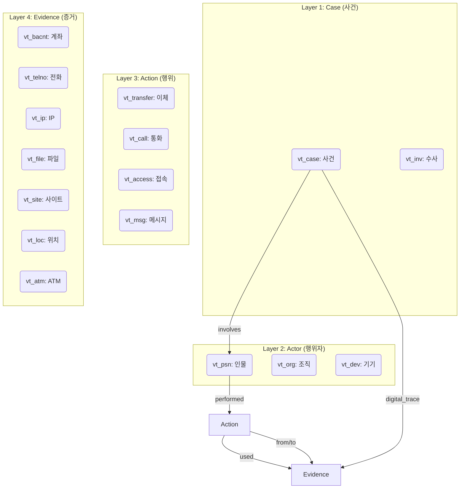

# KICS 사이버 범죄 온톨로지 가이드 (V2.0)

> **Version**: 2.0 (KICS Extended Model)  
> **Last Updated**: 2026-01-29  
> **Based on**: `ontology_service.py` (4-Layer Schema)

---

## 1. 개요 (Overview)

### 1.1 KICS 확장 모델 (4-Layer Model)

기존의 단순 사건 중심(Star Schema) 모델을 확장하여, **행위(Action)**와 **행위자(Actor)**를 중심으로 한 **4계층 모델**을 도입했습니다. 이는 "누가(Actor) 언제 어떤 행위(Action)를 하여 어떤 증거(Evidence)를 남겼는가"를 구조적으로 추적하는 데 최적화되어 있습니다.



---

## 2. 엔티티 온톨로지 (Entity Ontology)

총 16종의 엔티티가 4개 Layer로 분류됩니다.

### Layer 1: Case (사건 & 수사)

수사의 시작점이자 관리 단위입니다.

| Entity | Label | 주요 속성 (Properties) | 설명 |
|--------|-------|----------------------|------|
| **Case** | `vt_case` | `receipt_no`, `flnm`, `crime_type`, `damage_amount` | 수사 사건 (Anchor) |
| **Investigation** | `vt_inv` | `inv_id`, `investigator`, `department` | 수사 활동 정보 |

### Layer 2: Actor (행위자)

범죄 행위의 주체입니다.

| Entity | Label | 주요 속성 | 설명 |
|--------|-------|----------|------|
| **Person** | `vt_psn` | `name`, `id_no`, `role` (suspect/victim) | 용의자, 피해자, 참고인 |
| **Organization** | `vt_org` | `org_name`, `org_type` | 범죄 단체, 법인 |
| **Device** | `vt_dev` | `imei`, `mac_addr`, `model` | 물리적 기기 (폰, PC) |

### Layer 3: Action (행위/이벤트)

시간 정보(`timestamp`)를 가진 구체적 활동입니다. 모든 Action은 시계열 분석의 대상이 됩니다.

| Entity | Label | 주요 속성 | 관계된 증거 |
|--------|-------|----------|------------|
| **Transfer** | `vt_transfer` | `amount`, `timestamp`, `memo` | `from_account`, `to_account` |
| **Call** | `vt_call` | `duration`, `call_time` | `caller`, `callee` |
| **Access** | `vt_access` | `action`, `access_time`, `user_agent` | `accessed_from` (IP), `accessed_to` (Url) |
| **Message** | `vt_msg` | `content_hash`, `msg_time` | `sent_by`, `received_by` |

### Layer 4: Evidence (증거)

물리적/디지털 흔적으로 남은 객체입니다.

| Sub-Layer | Entity | Label | 주요 속성 | 비고 |
|-----------|--------|-------|----------|------|
| **Financial** | **BankAccount** | `vt_bacnt` | `actno`, `bank`, `holder` | 금융거래정보 |
| | **CryptoWallet** | `vt_crypto` | `wallet_addr`, `exchange` | 가상자산 |
| **Communication** | **Phone** | `vt_telno` | `telno`, `telecom` | 통신사실확인자료 |
| **Digital** | **NetworkTrace** | `vt_ip` | `ip_addr`, `isp` | 통신자료 |
| | **WebTrace** | `vt_site` | `url`, `domain` | 인터넷기록 |
| | **FileTrace** | `vt_file` | `filename`, `hash`, `size` | 디지털증거 |
| **Physical** | **Location** | `vt_loc` | `address`, `lat`, `lng` | 위치정보 |
| | **ATM** | `vt_atm` | `atm_id`, `location` | 물리증거 |

---

## 3. 관계 온톨로지 (Relationship Ontology)

### 3.1 주요 관계 정의

| 관계 타입 | Domain → Range | 의미 | 예시 |
|-----------|----------------|------|------|
| `performed` | Person → Action | 인물이 행위를 수행 | (홍길동)-[:performed]->(이체1) |
| `involves` | Case → Person | 사건에 인물이 연루 | (사건A)-[:involves]->(홍길동) |
| `belongs_to` | Person → Organization | 인물이 조직에 소속 | (행동대장)-[:belongs_to]->(보이스피싱단) |
| `uses_device` | Person → Device | 인물이 기기 사용 | (홍길동)-[:uses_device]->(갤럭시S24) |
| `used_account` | Action → BankAccount | 행위에 계좌 사용 | (이체1)-[:from_account]->(계좌A) |
| `digital_trace` | Case → Evidence | 사건에서 발견된 흔적 | (사건A)-[:digital_trace]->(IP주소) |
| `transferred_to` | BankAccount → BankAccount | 계좌 간 자금 이체 | (계좌A)-[:transferred_to]->(계좌B) |
| `contacted` | Phone → Phone | 전화번호 간 연락 | (전화A)-[:contacted]->(전화B) |
| `communicated_with` | NetworkTrace → NetworkTrace | IP 간 통신 | (IP_A)-[:communicated_with]->(IP_B) |

### 3.2 Action 중심 관계 (Who-did-What-to-Whom)

Action 노드는 행위자와 대상 객체를 연결하는 허브 역할을 합니다.

```cypher
-- 자금 이체 구조: (송금인) -> [이체행위] -> (출금계좌) -> (입금계좌)
MATCH path = (p:vt_psn)-[:performed]->(t:vt_transfer)-[:from_account]->(curr:vt_bacnt)
             -[:transferred_to]->(next:vt_bacnt)
RETURN path
```

---

## 4. 시간 및 출처 (Temporal & Provenance)

### 4.1 시간축 속성 (Temporal Properties)

범죄 재구성을 위해 모든 **Action 노드**와 **주요 엣지**에는 시간 정보가 필수입니다.

- `timestamp` (Datetime): 행위 발생 시각 (예: `2026-01-29T09:00:00`)
- `seq` (Integer): 동일 시간대 내 순서
- `duration` (Integer): 지속 시간 (초 단위)

### 4.2 출처 속성 (Provenance)

증거의 법적 효력을 위해 출처를 명시합니다.

- `source` (String): `telecom_reply` (통신사 회신), `bank_reply` (금융기관), `kics_export` (KICS)
- `confidence` (Float): 신뢰도 (0.0 ~ 1.0)
- `legal_category` (String): `통신사실확인자료`, `금융거래정보` 등 (법적 근거)

---

## 5. 5대 사이버 범죄 패턴 (Crime Patterns)

### 1) 몸캠피싱 (Bodycamp Phishing)
- **특징**: 채팅앱 접근 → 악성 APK 설치 유도 → 영상 녹화 협박 → 금전 편취
- **탐지 패턴**: `(사건)-[:digital_trace]->(APK파일)` AND `(사건)-[:used_account]->(대포통장)`

### 2) 보이스피싱 (Voice Phishing)
- **특징**: 기관 사칭/대출 사기 → 대포폰 → 자금 이체
- **탐지 패턴**: `(전화)-[:called]->(피해자)` AND `(계좌)-[:transferred_to]->(자금세탁계좌)`

### 3) 전화금융사기 (Phone Financial Fraud)
- **특징**: 조직적 콜센터 운영 → 다단계 이체
- **탐지 패턴**: `(조직원)-[:performed]->(Action)-[:used]->(대포폰/대포통장)`

### 4) 투자사기 (Investment Fraud)
- **특징**: 리딩방/가상자산 투자 유도 → 허위 사이트
- **탐지 패턴**: `(사건)-[:digital_trace]->(투자사이트)` AND `(사이트)-[:hosted_on]->(해외IP)`

### 5) 스미싱 (Smishing)
- **특징**: 미끼 문자(택배/부고) → 악성 URL 클릭
- **탐지 패턴**: `(문자)-[:contains_url]->(악성사이트)`

---

## 6. Cypher 쿼리 템플릿 (Query Templates)

### 6.1 자금 세탁 추적 (Money Laundering)

```cypher
MATCH path = (start:vt_bacnt)-[:transferred_to*3..]->(end:vt_bacnt)
WHERE all(r IN relationships(path) WHERE r.amount >= 1000000)
RETURN path
```

### 6.2 공범 네트워크 분석 (Accomplice Network)

```cypher
MATCH (p1:vt_psn)-[:performed]->(c:vt_call)-[:caller|callee]-(phone:vt_telno)
MATCH (p2:vt_psn)-[:performed]->(c2:vt_call)-[:caller|callee]-(phone)
WHERE p1 <> p2
RETURN p1.name, p2.name, phone.telno AS shared_phone
```

## 7. 참고 문서

- [DATABASE_ARCHITECTURE.md](./DATABASE_ARCHITECTURE.md): 시스템 아키텍처
- [NODE_LABELS_GUIDE.md](./NODE_LABELS_GUIDE.md): 노드 라벨 상세 가이드
- `app/services/ontology_service.py`: 온톨로지 소스 코드
