# CCOP 온톨로지 단일 소스 아키텍처

> 최종 업데이트: 2026-02-19

## Single Source of Truth 구조

모든 엔티티 인식과 관계 매핑은 **`ontology_service.py`** 한 곳에서 정의되며, 나머지 서비스는 이를 참조만 합니다.

```mermaid
graph TD
    subgraph SSOT["ontology_service.py (단일 소스)"]
        CP["COLUMN_PATTERNS<br/>22개 컬럼 타입 패턴"]
        CTR["COLUMN_TYPE_TO_RDB<br/>온톨로지→RDB 키 매핑"]
        REL["RELATIONSHIPS<br/>엣지 정의 + 법적 분류"]
        GRR["get_relationship_rules()<br/>55개 추론 규칙 자동 생성"]
    end

    subgraph CONSUMERS["참조 서비스"]
        RDB["rdb_service.py<br/>CSV→RDB 적재"]
        R2G["rdb_to_graph_service.py<br/>RDB→GDB 변환"]
        RI["relationship_inferencer.py<br/>AI 자동 분석"]
    end

    CP --> RDB
    CTR --> RDB
    CP --> RI
    REL --> GRR
    GRR --> RI
    R2G -->|"RELATION_TO_EDGE"| RDB

    style SSOT fill:#1a1a2e,stroke:#e94560,stroke-width:2px
    style CONSUMERS fill:#16213e,stroke:#0f3460,stroke-width:1px
```



---

## 단일 소스 정의 목록

### 1. COLUMN_PATTERNS — 컬럼 인식 패턴

| 타입 | 패턴 예시 | GDB 라벨 | RDB col_map 키 |
| :--- | :--- | :--- | :--- |
| `case_id` | 접수번호, 사건번호, case_no | `vt_case` | `case` |
| `user_id` | 아이디, ID, 피의자, 닉네임 | `vt_psn` | `suspect` |
| `nickname` | 닉네임, nickname, nick | `vt_psn` | `nickname` |
| `person` | 이름, name, 성명 | `vt_psn` | `name` |
| `account` | 계좌, account, actno | `vt_bacnt` | `account` |
| `phone` | 전화, phone, tel | `vt_telno` | `phone` |
| `ip` | IP, ip주소, ip_addr | `vt_ip` | `ip` |
| `sender` | 송금, 출금, sender | `vt_bacnt` | `sender` |
| `receiver` | 수취, 입금, receiver | `vt_bacnt` | `receiver` |
| `caller` | 발신, caller, 발신번호 | `vt_telno` | `caller` |
| `callee` | 수신, callee, 수신번호 | `vt_telno` | `callee` |
| `amount` | 금액, amount | (속성) | `amount` |
| `crime` | 죄명, crime | (속성) | `crime` |
| `date` | 등록일, 날짜, date | (속성) | `date` |
| `duration` | 시간, duration | (속성) | `duration` |

### 2. RELATION_TO_EDGE — 관계 매핑

| (source, target, rdb_rel_type) | GDB 엣지 | 수사 의미 |
| :--- | :--- | :--- |
| (case, suspect, involves) | `involves` | 사건 연루 |
| (case, account, evidence) | `eg_used_account` | 사건 계좌 |
| (case, phone, evidence) | `eg_used_phone` | 사건 전화 |
| (case, ip, evidence) | `eg_used_ip` | 사건 IP |
| (suspect, account, owns) | `has_account` | 소유 계좌 |
| (suspect, phone, owns) | `owns_phone` | 소유 전화 |
| (suspect, ip, owns) | `used_ip` | 사용 IP |

### 3. RELATIONSHIPS — 온톨로지 정의

각 엣지 타입에 대해 다음 속성이 정의됨:
- `domain` / `range`: 출발/도착 엔티티 타입
- `source_types`: AI 분석용 (source, target) 쌍
- `semantic_relation`: 온톨로지 시맨틱 관계명
- `legal_significance`: 법적 분류 (금융거래정보, 통신사실확인자료 등)
- `meaning`: 한국어 의미 설명

---

## 새 엔티티/관계 추가 방법

### 새 컬럼 타입 추가 시
`ontology_service.py`에서 **2곳만 수정**:

```python
# 1. COLUMN_PATTERNS에 패턴 추가
"new_type": {
    "patterns": ["패턴1", "패턴2"],
    "kics_label": "vt_new",
    "kics_property": "prop",
    "description": "설명"
}

# 2. COLUMN_TYPE_TO_RDB에 매핑 추가
COLUMN_TYPE_TO_RDB = {
    ...
    'new_type': 'rdb_key',
}
```

→ `rdb_service.py`, `relationship_inferencer.py` 자동 반영

### 새 관계 타입 추가 시
`rdb_to_graph_service.py`에서 **1곳만 수정**:

```python
# RELATION_TO_EDGE에 매핑 추가
('source', 'target', 'rdb_rel'): 'gdb_edge_label',
```

→ `rdb_service.py` 자동 반영

### 온톨로지 정의도 추가 (선택)
`ontology_service.py`의 `RELATIONSHIPS`에 정의 추가 시 → AI 분석, 법적 분류, 시맨틱 분석 자동 반영
