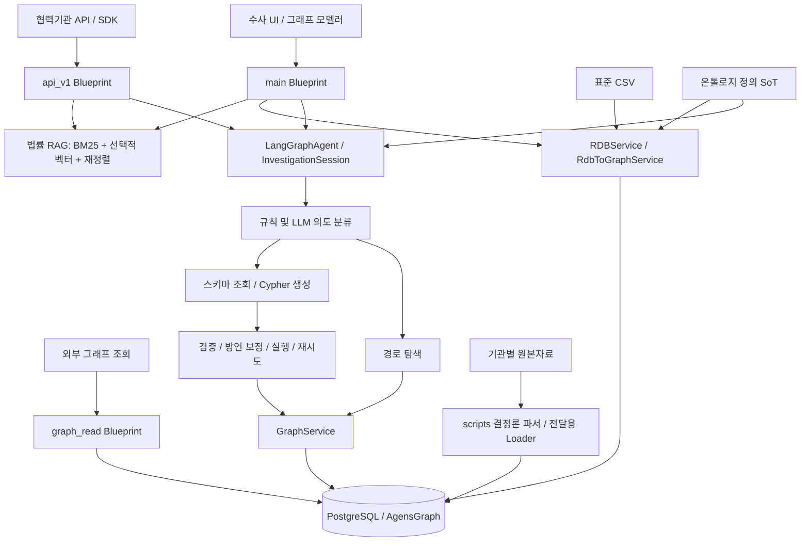

# CCOP 프로젝트 코드·문서 종합 분석 및 검증

코드·검증 기준일: 2026-09-17 · 정리 완료일: 2026-09-18 · 대상: `/Users/iankwon/test/coop_v1.0`

완료 시점 재확인: HEAD는 `75401a2`로 동일하며 분석 기준 이후 추가 코드 변경은 없다.

## 1. 종합 판단

CCOP는 **수사자료를 공통 온톨로지로 연결하고, 자연어·시각적 탐색으로 사건 간 관계를 분석하는 Flask 기반 플랫폼**이다. 현재 구현은 초기 README의 8종 노드·단순 CSV 시각화 범위를 크게 넘어섰다. V4.8 온톨로지, 사건별 결정론 파서, LangGraph Text2Cypher, 시간축 보정, 그래프 알고리즘, 법률 RAG, 협력기관 CSV 전달 패키지가 존재한다.

강점은 온톨로지 정의와 전달 명세, 자연어 질의의 실행 전후 보정, DB 없이 검증 가능한 테스트, 출처 추적에 대한 설계다. 그러나 **공통 인증·그래프 접근 정책, 적재의 식별자/재실행 계약, UI와 전달용 적재기의 기능 일치, 테스트 회귀와 배포 재현성**을 먼저 정비해야 한다. 현재 결과만으로 외부 공개·다중 사용자 운영의 준비가 완료됐다고 판단할 수 없다.

특히 “예제 CSV 규격 검사 통과”, “특정 통합 그래프 정합 감사 통과”, “제품의 모든 적재 경로가 올바름”은 서로 다른 검증이다. 이번 점검에서 앞의 성과와 동시에 실제 API·적재 결함이 확인됐다.

## 2. 분석 범위와 증거 수준

| 구분 | 범위·결과 |
|---|---|
| 코드 기준 | 최초 HEAD `64b6d04`, 종료 시 HEAD `75401a2`. 두 커밋 차이는 `MAIL_ETRI_REVIEW.md` 추가뿐이며 코드 변경은 없음 |
| 기존 작업 | `tests/vt_check.js`의 기존 수정 보존 |
| 전체 목록 | Git 추적 파일 622개, Markdown 154개, Python 231개 |
| 코드 규모 | Python 61,852행, 이 중 `app/` Python 20,808행. 주석·공백 포함 |
| API | 라우트 선언 92개 목록화. URL별 권한표는 별도 전체 목록에 수록 |
| Python 정적 검사 | 231개 파일 AST 파싱, 문법 오류 0개 |
| 셸·프론트 문법 | 셸 27개 `bash -n` 통과. 렌더링한 index/modeler의 실행 JS 4블록 `node --check` 통과. 두 페이지의 정적 src/href 파일 누락 0개 |
| 테스트 | 전체 293개 수집, 오프라인 적합 240개 실행: **236 통과·3 실패·1 예상 실패** |
| 구조 문서 | PDF 8개·87쪽 텍스트 추출, Excel 명세 3개·17시트 읽기 및 셀 오류 점검 |
| CSV 규격 | 전달 패키지 예제 13종 `--strict` 검사 통과 |
| 재현 방식 | 임시 복사본, 가짜 설정, DB·네트워크 차단, Mock cursor/서비스 및 Flask test client 사용 |

전체 파일을 목록화하고 정적 구조를 검사했으며, 핵심 실행·인증·적재·온톨로지·질의·배포 경로를 심층 대조했다. 모든 코드 줄의 의미, 역사 문서의 외부 인용, 원본 수사 데이터 전체를 개별 검증한 것은 아니다. PDF·Excel은 내용/구조 점검이며 모든 페이지의 시각적 편집 품질 검사는 아니다.

실제 운영 DB, 원격 서버, LLM API, Docker 이미지 빌드, 브라우저 상호작용 E2E는 이번에 실행하지 않았다. DB 크래시 우회가 문서화된 환경이므로 운영 질의·적재 스크립트를 무차별 실행하지 않았다. 운영 데이터·설정·API 키 파일은 변경하지 않았다. 법률·특허 관련 문서는 기술 문서 분류에 포함했으며 법률적 타당성을 검토한 것은 아니다.

분석 산출물:

- [코드·문서·API 전체 목록](PROJECT_CATALOG_20260917.md)
- [기계 판독 가능한 검증 증거](audit/20260917/evidence.json)

## 3. 실제 아키텍처

### 실행 진입점과 모듈

| 영역 | 실제 기준 파일 | 역할·주의점 |
|---|---|---|
| 앱 생성 | `app/__init__.py` | Flask 설정, CORS, 선택적 Basic Auth, gzip, 보안 헤더, API 키 로드, 4개 Blueprint 등록 |
| 실행 설정 | `run.py`, `config.py` | 로컬 기본 5002, Gunicorn 5001. 두 파일의 DEBUG 결정 방식이 다름 |
| UI/API | `app/routes.py`, `app/routes_api.py` | UI용 `/api/*`와 파트너 `/api/v1/*`가 병존하며 인증·입력 계약이 균일하지 않음 |
| 외부 조회 | `app/routes_graph_read.py` | X-API-Key 별도 체계. read/dump/schema, 직접 DB 연결 |
| 관리자 | `app/routes_admin.py`, `app/middleware/api_auth.py` | 세션 관리자 인증, JSON 파일 기반 API 키 관리 |
| 그래프 | `app/services/graph_service.py` | 검색·확장·방향성 경로·Cypher 실행·수동 수정. 주로 직접 psycopg2 연결 |
| 자연어 질의 | `ai_service.py`, `langgraph_agent.py` | 의도 분류, 스키마 기반 생성, 실행 보정, 오류 성찰, 응답·감사 |
| 표준 CSV/RDB | `rdb_service.py`, `rdb_to_graph_service.py` | CSV→RDB→그래프. 운영 표준/스테이징/과거 스키마가 혼재 |
| 범용 직접 CSV | `etl_service.py` | 사용자가 지정한 컬럼·라벨로 직접 그래프 적재. 표준 적재기와 별도 구현 |
| 협력기관 CSV | `scripts/load_partner_csv.py`, `handoff/csv_spec_v4.8/load_csv_to_graph.py` | 최신 13종 규격과 집계형 관계를 지원하는 별도 CLI |
| 온톨로지 SoT | `app/middleware/services/ontology_service.py` | 실제 정의. `app/services/ontology_service.py`는 re-export alias |
| 법률 RAG | `legal_rag_service.py`, `legal_vector_store.py` | BM25, 벡터 검색, RRF, 재정렬, 근거와 답변 생성 |
| 분석 | `graph_algo_service.py`, `pattern_analyzer.py`, `evidence_analyzer.py` | NetworkX 알고리즘, 범죄 패턴 대조, 증거 체크리스트 점수 |
| 프론트 | `app/templates/index.html`, `modeler.html` | 각각 8,270·2,246행의 대형 템플릿. 그래프 표시·업로드·질의·모델러 로직 집중 |

`app/core/cypher_service.py`는 현재 활성 코드에서 호출하는 참조를 찾지 못했다. 실제 주 실행은 AgensGraph 네이티브 Cypher이며, SQL wrapper가 들어오면 `GraphService.execute_cypher`가 내부 Cypher를 추출한다. `few_shot_router.py`도 문서상 운영 사용 설명과 달리 현재 `app/` 다른 모듈의 호출 참조를 찾지 못했다.

## 4. 온톨로지·데이터 계약

직접 import해 확인한 V4.8 정의는 **노드 라벨 25종, 관계 72종, 활성 관계 70종**이다. Source·Case·Person·Object·Location·Event의 6개 층을 사용한다. 초기 4계층 설명은 최신 구현의 요약으로 적절하지 않다.

주요 엔티티는 인물·기관·계좌·전화·IP·디지털 계정·사이트·기기·차량·위치·사건과 이체/통화/접속/메시지/이동/사칭 이벤트다. 사건과 사람의 역할, 소유·사용·접속·이체 관계를 분리하고 `source_id`, 기록 시각, 신뢰도 등 메타데이터를 부여한다.

검증 결과:

- 전달용 Python 정의와 앱 SoT의 노드명/엣지명 집합이 일치한다. 모든 속성·정책까지 완전 동등하다는 검사는 아니다.
- Excel의 엣지 카탈로그에서 SoT 72종을 확인했다. 노드 25종도 문자열 앞뒤 공백을 제거하면 일치한다. `pt_cluster `·`site_cluster `에는 후행 공백이 있어 기계 입력 시 정규화가 필요하다.
- **앱 내부 적재기와 T2C의 별도 하드코딩 목록은 `sameAs`를 사용하지만 SoT는 `same_as`다.** 외부 전달 명세 일치와 앱 전체 일치는 구분해야 한다.
- `GraphService.create_graph`는 `vt_event`, `vt_persona` 등 과거 라벨도 기본 생성한다. 신규 그래프 생성 경로도 V4.8 카탈로그 기반으로 통일할 필요가 있다.
- 집계형 `contacted`·`transferred_to`와 개별 이벤트 노드 경로는 정보 해상도가 다르다. 쌍별 건수·최초/최종 시각만으로 개별 메시지·거래의 시간 순서를 복원할 수는 없다.

핵심 계약은 라벨뿐 아니라 **식별키, 숫자/문자열 타입, 관계 방향, 시간 정밀도, 출처 집합, 집계/원본 전환 규칙**까지 포함해야 한다. 현재 테스트는 라벨·메타 헬퍼에 비해 재적재·동명이인·은행별 동일 계좌번호·플랫폼별 동일 ID 같은 충돌 조건이 부족하다.

## 5. 자연어 질의와 분석 기능

### Text2Cypher 흐름

실제 UI 질문 진입점은 `POST /api/query/ai`다. 파트너는 `/api/v1/text-to-cypher` 또는 `/api/v1/agentic-query`를 사용한다. `/text-to-cypher`도 단순 문자열 생성만 하는 것이 아니라 에이전트 실행 결과를 반환한다.

LangGraph의 기본 흐름은 router → context retrieval → schema fetching → synthesis → execution → data view이며, 오류 시 reflection → synthesis로 돌아간다. PATH 의도는 별도 경로 탐색 노드를 거치며 실패하면 일반 QUERY 경로로 전환한다.

현재 코드에서 확인한 방어·보정은 스키마 라벨 검증, 쓰기 키워드 차단, 은행명/속성값 정규화, ORDER BY·RETURN 방언 보정, 경로 조건 재작성, 0건 진단·2-hop 보완, 시간순 조건 주입, 모델 결과와 앵커 보강 결과의 구분이다. 이는 유용한 방어층이지만 SQL 실행 권한과 공통 접근 정책을 대신하지는 못한다.

`context_retrieval_node`의 실제 구현은 `GraphService.search_nodes`로 엔티티를 조회한다. 해당 함수 주석과 분석 문서의 “Vector DB 유사 질의 검색” 설명은 현재 동작과 다르다. 법률 RAG의 벡터 검색과 T2C의 엔티티 검색을 구분해야 한다.

OpenAI 키가 없으면 router는 규칙 분류, reflection은 결정론 진단 피드백으로 폴백하는 코드가 존재한다. 따라서 “reflection은 항상 OpenAI만 사용”이라는 과거 설명은 최신 상태가 아니다. 다만 폐쇄망의 실제 모델 응답 품질·지연시간까지 이번 검사에서 검증한 것은 아니다.

### 법률 RAG와 기타 분석

법률 RAG는 한글 bigram BM25, 선택적 벡터 검색, RRF 결합, 선택적 LLM 재정렬로 구성된다. 기본 벡터 저장 경로는 PostgreSQL BYTEA와 numpy이며 Chroma는 선택형이다. 임베딩이 없으면 BM25로 강등하고, 생성 LLM이 없으면 근거 검색 결과와 실패 상태를 반환한다. 관련 오프라인 테스트 39개가 통과했다. 법률 코퍼스의 최신성·정답률은 미검증이다.

그래프 알고리즘과 범죄 패턴 점수는 구분해야 한다. 전자는 그래프 구조/메트릭 계산이고 후자는 사전에 정의한 패턴과의 대조다. 패턴/증거 점수는 구현상 휴리스틱이며 사건의 법적 입증 확률을 나타내지 않는다. 현재 정상 자금세탁 체인을 놓치는 알려진 패턴 매칭 결함이 예상 실패 테스트로 남아 있다.

## 6. 재현된 주요 문제와 우선순위

우선순위는 이번 검토의 제안이다. P0는 외부 제공 전에 접근 경계를 확정할 항목, P1은 정확성·핵심 기능·배포를 직접 깨뜨리는 항목, P2는 운영 안정성·유지보수 개선 항목이다. Mock 재현은 앱이 해당 동작을 허용한다는 증거이며 실제 운영 DB가 변경됐다는 뜻이 아니다.

### F01 · P0 · 인증과 그래프 접근 제한이 전체 경로에 적용되지 않음

근거: `app/__init__.py:21`, `app/routes.py:94`, `:165`, `:181`, `:223`, `app/routes_api.py:94`, `app/routes_graph_read.py:50`.

- Basic Auth 미설정 상태에서 익명 `/api/graph/clear` 호출이 HTTP 200으로 Mock 변경 서비스까지 도달했다.
- 익명 `/` 접근만으로 `ui_authorized=True` 세션이 발급된다. 이 플래그 자체는 사용자 로그인/권한 검증이 아니다.
- `ALLOWED_GRAPHS`는 main Blueprint의 `graph_path` 필드만 검사한다. `graph_name`을 받는 삭제 API로 금지 그래프를 전달하면 통과한다.
- `/api/v1/graph-query`, 외부 `/api/v1/graph/read`에서도 금지 그래프가 Mock 실행까지 도달했다.

영향은 배포의 Basic Auth·네트워크 경계·DB 권한에 따라 달라진다. 코드 자체의 통합 권한 검증은 불완전하다. 요청별 인증 주체와 읽기/쓰기 권한을 정의하고, graph_path·graph_name·중첩 schema·기본 그래프를 한곳에서 해석한 뒤 모든 Blueprint와 서비스 실행 경로에 같은 정책을 적용해야 한다.

### F02 · P1 · 읽기 전용 질의 가드와 결과 제한이 불완전함

근거: `app/services/graph_service.py:1105`, `app/routes_api.py:133`, `app/routes_graph_read.py:27`, `:79`.

`GraphService.execute_cypher`의 금지 단어에는 INSERT·UPDATE·TRUNCATE 등 SQL 쓰기 구문 일부가 없다. `INSERT INTO audit_table VALUES (1) RETURNING 1`이 기본 읽기 전용 경로에서 Mock cursor까지 전달됐다. 실제 실행 여부는 DB 권한에 달려 있다. `ccop_test_graph`는 읽기 전용 기본값도 쓰기 허용으로 바꾼다.

외부 read API는 더 많은 쓰기 단어를 차단하지만 Cypher 문법으로 입력을 한정하지 않는다. `SELECT pg_sleep(1)`이 검사상 허용됐다. 요청 limit=1이어도 쿼리에 `LIMIT 999999`가 있으면 그대로 전달된다. 트랜잭션 read-only, 실행 시간·행수 상한, 허용 문장 검증을 실행 계층에 결합해야 한다. regex 금지 목록만을 데이터 보호의 최종 경계로 두면 안 된다.

### F03 · P1 · API 키 만료 누락과 Basic/Bearer 인증 충돌

근거: `app/middleware/api_auth.py:143`, `app/models/api_key.py:113`, `app/__init__.py:27`.

만료일이 지난 테스트 키는 `APIKey.is_expired=True`인데 `validate_api_key`는 승인했다. 인증 함수는 is_active만 확인하고 만료 함수를 호출하지 않는다.

Basic Auth가 켜진 앱에 유효한 Bearer 키를 보내면 전역 Basic 검사가 먼저 401을 반환한다. 동일 Authorization 헤더에 두 인증 방식을 동시에 넣을 수 없으므로, UI와 파트너 API의 인증 경계를 구분해야 한다. 예외 처리는 API 인증 자체를 생략하는 방식이 아니라 각 경로의 명시적 인증 정책으로 구현해야 한다.

### F04 · P1 · CSV 매핑 API가 없는 메서드를 호출해 500 반환

근거: `app/routes.py:1524`, `:1598`, `app/services/ai_service.py`.

`AIService.suggest_mapping`, `AIService.infer_column_mapping_for_rdb`는 현재 클래스에 없다. 한 행 CSV를 업로드한 `/api/etl/ai-suggest`와 미지 컬럼을 포함한 `/api/rdb/analyze-csv`에서 AttributeError와 HTTP 500을 재현했다. 기존 SchemaMapper로 연결하거나 정식 메서드 계약을 복구해야 한다. LLM 연결 문제와 무관한 구현 누락이다.

### F05 · P1 · 최신 전달용 적재기의 재실행 멱등성이 깨짐

근거: `scripts/load_partner_csv.py:15`, `:105`, `:123`, `:172`, `:187`. 전달본 `load_csv_to_graph.py`에도 같은 변경이 있다.

9월 17일 수정은 대량 MERGE 오류를 피하려고 노드를 CREATE하고 `_seen`으로 한 실행 내부의 중복을 생략한다. 캐시는 재실행 때 비워지지만 `--reset`은 선택 옵션이며 기존 그래프에도 적재할 수 있다. 새 Loader 두 개로 같은 노드를 넣으면 CREATE가 두 번 발생한다. 문서의 “같은 폴더를 두 번 적재해도 중복 없음”과 다르다.

새 그래프 전용 모드라면 비어 있지 않은 대상은 명시적으로 거부해야 한다. 증분/재실행 지원이 필요하면 DB의 기존 식별자를 읽어 초기 캐시를 구성하거나 안전한 upsert를 구현하고 2회 적재 회귀를 추가해야 한다. 해결책으로 운영 그래프에 무조건 `--reset`을 적용해서는 안 된다.

### F06 · P1 · 은행·동명이인·플랫폼 식별 계약이 충분히 구현되지 않음

근거: `scripts/load_partner_csv.py:128`, `:202`, `:214`, `:223`, `handoff/csv_spec_v4.8/README.md:145`.

캐시와 노드 생성 기준은 `(label, key, value)`다. 계좌는 account_no만, 인물은 name, 디지털 계정은 id_val을 사용한다. 은행코드·psn_id·platform은 속성으로만 들어가므로 식별을 분리하지 못한다.

Mock 재현에서 같은 계좌번호/다른 은행코드 2건은 노드 1개, 같은 이름/다른 psn_id 2건도 노드 1개로 처리됐다. 문서의 “bank_cd를 주면 오병합이 사라진다”, “psn_id가 있으면 그것으로 식별한다”는 보장이 코드에 반영되어 있지 않다. 노드 키와 관계의 MATCH 키를 함께 변경해야 한다. 첫 행 이후 캐시 생략으로 추가 출처·속성 보강도 빠질 수 있다.

### F07 · P1 · 전달 규격과 UI 적재기 간 지원 차이 및 실패의 성공 표시

근거: `app/services/rdb_service.py:52`, `:314`, `app/routes_api.py:1584`, `:1759`.

전달용 CLI는 13종 규격을 지원하지만 UI가 호출하는 `import_predefined_schema_to_rdb`에는 새 선택 양식의 핸들러가 없다. `tbl_eg_ip_use.csv`를 넘기면 INSERT 0회·모든 적재 수 0인데 `success=True`가 반환됐다. 따라서 협력기관 전달 규격 통과가 UI 지원을 의미하지 않는다.

별도 재현에서는 RDB 적재 실패와 그래프 변환 실패를 주입해도 파이프라인 최상위 응답은 HTTP 200·`status=success`였고, 하위 L4에만 `success=false`가 있었다. 미지원 파일을 오류로 분류하고, 단계 실패/부분 성공/완료를 구분하며 UI와 CLI가 같은 규격 등록부를 사용하도록 정리해야 한다.

### F08 · P1 · SoT와 적재·T2C의 same_as 불일치

근거: `app/services/rdb_to_graph_service.py:217`, `:1499`, `app/services/langgraph_agent.py:547`, `:589`, `app/middleware/services/ontology_service.py:1225`.

SoT는 `same_as`, 적재 코드와 T2C 기본 스키마는 `sameAs`다. 관련 테스트 2개가 실제 실패했다. 이름만 바꾸기 전에 기존 DB의 실제 라벨을 읽기 전용으로 조사하고 호환·이관 방침을 정해야 한다. 현재의 중복 하드코딩 목록을 SoT에서 파생시키는 것이 재발 방지책이다.

### F09 · P1 · 폐쇄망 빌드 입력과 의존성 선언 충돌

근거: `.dockerignore`의 `/requirements.airgap.txt`, `Dockerfile.airgap:17`, `scripts/build_airgap_bundle.sh:72`, `requirements.airgap.txt`, `app/services/graph_algo_service.py:19`.

폐쇄망 Dockerfile은 requirements.airgap.txt를 COPY하지만 .dockerignore는 해당 파일을 제외한다. 번들 스크립트는 이 Dockerfile을 우선 선택한다. 현재 설정 그대로의 빌드에는 입력 파일 충돌이 있다. 이번에 Docker 빌드를 실행한 것은 아니다.

폐쇄망 requirements에는 networkx가 없지만 UI 자연어 질의/알고리즘 경로가 networkx 모듈을 지연 import한다. 기본 앱 생성만 성공해도 해당 기능의 실행은 보장되지 않는다. 두 requirements의 런타임 계약을 비교하고 폐쇄망 이미지에서 질의·업로드·알고리즘 smoke test를 수행해야 한다.

### F10 · P2 · 스칼라 조회의 반환 계약과 테스트 불일치

근거: `app/services/langgraph_agent.py:1035`, `:1090`, `tests/test_t2c_v37_helpers.py:24`.

`RETURN d.device_id, d.imei`가 시각화용 `RETURN d`로 변환되어 기존 2개 스칼라 컬럼 테스트가 실패했다. 코드 주석상 의도적 동작이므로 곧바로 구현 오류로 단정하지 않는다. 표 형식 조회와 그래프 시각화의 반환 계약을 분리하고, 의도된 변경에 맞는 테스트를 마련해야 한다. 이 실패 테스트는 현재 CI 선택 목록에도 포함된다.

### F11 · P2 · 정상 자금세탁 체인을 놓치는 패턴 매칭 결함

근거: `app/services/pattern_analyzer.py:170`, `tests/test_pattern_network_analysis.py:225`.

같은 라벨의 필수 노드를 각각 다른 개체로 매칭하지 못한다. 테스트의 정상 체인 7개 노드가 고유 매칭 2개로 축소되며, 예상 점수가 기준에 미달한다. `xfail(strict=True)`는 이 결함을 기록한 것이며 해결을 의미하지 않는다. 라벨 존재 여부를 넘어 노드의 개별 대응과 관계 연결을 검사해야 한다.

### F12 · P2 · 비활성 보조 경로의 연결 풀 고갈

근거: `app/database.py:14`, `:67`, `app/services/subgraph_service.py:7`, `:33`.

풀에서 받은 연결을 SubGraphService가 `release_db_connection` 대신 `conn.close()`로 닫는다. 실제 psycopg2 SimpleConnectionPool에 Mock 연결을 연결한 반복 재현에서 10개가 계속 대여 상태로 남고 다음 획득이 실패했다.

현재 `SubGraphService.get_schema`의 활성 호출 참조는 찾지 못했다. 따라서 이를 주 그래프 API의 현재 장애로 단정하지 않는다. 주 GraphService는 별도 직접 연결을 사용한다. 향후 재사용·풀 통합 전 반환 계약을 바로잡고, 동시 사용 시 thread-safe 풀과 앱별 수명주기를 검토해야 한다.

## 7. 추가 운영·품질 관찰

| 항목 | 확인한 사실·의미 |
|---|---|
| 기본 디버그 노출 | `Config.DEBUG`는 development일 때만 True지만 `run.py:13`은 production이 아니면 debug=True. 환경 미설정 실행의 Mock 인자는 `host=0.0.0.0, port=5002, debug=True` |
| 다중 worker 상태 | API 키 저장소·rate limit·수사 세션·작업 상태·RDB 소스·일부 캐시가 프로세스 메모리에 있음. Gunicorn worker 간 키 폐기·세션·제한값 일관성이 보장되지 않음. 실제 부하 재현은 미수행 |
| JSON 영속화 | 파일 lock은 쓰기 직렬화만 보장. worker별 오래된 dict의 덮어쓰기와 변경 내용 재로드 문제는 별도 해결 필요 |
| 업로드 격리 | 통합 파이프라인은 `/tmp/{secure_filename}`와 공유 `test_v40`, 기본 fresh 초기화를 사용. 동명 동시 업로드·다중 사용자 작업 충돌 가능성. 요청별 임시 디렉터리와 적재 job 격리가 필요 |
| 범용 직접 ETL | `ETLService.import_csv`는 `pd.read_csv`에 dtype=str을 지정하지 않고 속성을 문자열 중심으로 조립. 선행 0·숫자 비교·타입 계약을 표준 적재 경로와 별도 검증해야 함 |
| 연결 정리 | 외부 read/dump/schema는 예외 시 finally 정리가 없으며 여러 서비스가 직접 연결. 오류 경로에서도 cursor/connection을 확실히 닫는 공통 컨텍스트 필요 |
| DB 전환 | `/api/db/switch`는 전역 설정 dict를 변경. 이미 생성한 풀·worker·스키마 캐시와의 일관성은 별도 처리되지 않음 |
| 헬스체크 | `/api/v1/health`는 고정 healthy 응답으로 생존 확인용. Dockerfile의 requests.get은 HTTP 오류 상태를 실패로 처리하지 않음. 생존·준비 상태를 분리해야 함 |
| 시간 정밀도 | `temporal_continuity._time_expr`는 date(...)를 사용. 초 단위 선후관계를 보장하는지 별도 계약 필요. 시간 축 헬퍼 단위 테스트 통과가 초 단위 분석 검증은 아님 |
| 알고리즘 캐시 | GraphAlgoService의 fingerprint는 노드/엣지 개수. 개수를 유지한 관계/속성 변경은 캐시 무효화 기준에 잡히지 않음 |
| 감사 기록 | 일부 감사는 비동기 daemon thread·예외 무시, 대표 쿼리 저장 방식. 코드 주석의 “위변조 불가”를 보장할 저장 권한/불변 저장소 검증은 없음 |
| SDK | `sdk/cslee_integration.py`에 토큰 형태의 상수가 하드코딩되어 있음. 실제 활성 여부는 확인하지 않음. 값은 보고서에 재기록하지 않으며 환경변수/명확한 예시값으로 정리 필요 |
| iframe 연동 | 앱 CSP는 frame-ancestors none. Nginx의 iframe 허용 안내만 변경해도 앱 CSP와 충돌할 수 있어 최종 응답 헤더 기준 검증 필요 |
| 대형 파일 | 라우트·서비스·HTML에 여러 책임이 집중. 변경 전 계약 테스트를 확보하고 기능별 Blueprint/프론트 모듈로 점진 분리하는 편이 안전 |

## 8. 테스트 결과와 해석

| 테스트 모듈 | 통과 | 실패 | 예상 실패 |
|---|---:|---:|---:|
| security | 37 | 0 | 0 |
| api_persistence | 25 | 0 | 0 |
| etl_v40_meta | 14 | 0 | 0 |
| ip_role_temporal | 16 | 0 | 0 |
| lazy_expansion | 7 | 0 | 0 |
| legal_rag | 39 | 0 | 0 |
| loader_sot_consistency | 5 | 2 | 0 |
| ontology_transform_viz | 25 | 0 | 0 |
| pattern_network_analysis | 26 | 0 | 1 |
| rdb_normalization | 11 | 0 | 0 |
| t2c_v37_helpers | 19 | 1 | 0 |
| temporal_continuity | 12 | 0 | 0 |
| **합계** | **236** | **3** | **1** |

총 4.35초. 로컬 `.venv` Python 3.9.6, pytest 8.4.2로 실행했다. requirements는 pytest 7.4.4, Docker는 Python 3.10이므로 동일한 런타임 재현을 의미하지 않는다. Flask 3.0.0, psycopg2 2.9.9, openai 2.15.0, langgraph 0.6.11, pandas 2.1.4, networkx 3.2.1은 확인했다. `pip check`에서는 grpcio 1.76.0의 현재 플랫폼 비지원 문제가 보고됐다.

수집된 293개 중 53개는 이번 실행 집합에서 제외했다. 실제 DB/LLM·실행 중인 UI를 요구하는 테스트와 진단 스크립트가 섞여 있다. 일부 진단 파일은 예외를 출력만 하거나 현재 없는 과거 AIService 메서드를 참조하므로 전체 pytest의 단순 녹색 상태만으로 제품 품질을 판단하면 안 된다.

CI는 7개 오프라인 테스트 모듈을 실행하지만 loader_sot_consistency, temporal_continuity, ip_role_temporal, lazy_expansion, rdb_normalization은 현재 선택 목록에 없다. 앱 시작 검증은 실패해도 `|| echo`로 넘어간다. **이번에 통과한 테스트는 해당 계약의 검증이며, 발견된 인증 우회·적재 식별 충돌의 부재를 보장하지 않는다.**

테스트는 원본 저장소에서 그대로 실행하지 않고 임시 복사본으로 실행했다. dotenv 로드를 비활성화하고 DB 접속 및 소켓 연결을 차단했으며 JSON API 키 쓰기는 복사본의 data에 한정했다. 동일 검증 재실행 시에도 이 격리 조건을 유지해야 한다.

## 9. 문서 정합성 검토

| 문서·설명 | 현재 코드와의 차이 | 정리 방향 |
|---|---|---|
| AGENTS.md | AGE wrapper 중심 실행, 중복 middleware 서비스 잔존, Chroma 중심 RAG 설명 | 활성 네이티브 실행·현재 SoT 위치·BM25/선택 벡터로 수정 |
| README.md | 초기 8노드, localhost:5001, 존재하지 않는 파일/일부 엔드포인트 | 설치·실행·현재 기능·실제 API로 재작성 |
| CLAUDE.md | AGENTS보다 최신이나 4계층/모델 학습 이력 등 과거 설명 혼재 | 공통 아키텍처 문서 참조로 중복 최소화 |
| T2C_ANALYSIS_20260916.md | `/api/v1/query` 표기, Vector retrieval 설명, OpenAI 의존 해소 전후 설명 동시 존재 | 코드 진입점으로 교정하고 완료 사항을 제안 목록에서 제거 |
| PROJECT_STATUS_20260914.md | 운영 스냅샷·벤치 결과를 담은 시점 문서 | 최신 코드 검증과 구분. 숫자의 측정일·그래프·벤치 세트 명시 |
| 05_OPEN_ISSUES.md | 4월 v3.3, 제거된 middleware 경로와 당시 완료율 | 역사 문서로 표시하고 최신 이슈 목록과 분리 |
| CSV V4.8 전달 문서 | 멱등성, bank_cd·psn_id 식별 보장과 최신 Loader 불일치 | F05/F06 구현·문서를 함께 고친 후 재배포 |
| PDF·Excel | 역사 버전·동일 문서의 파생 포맷이 공존 | 기준 원문과 생성일·대응 커밋을 표기 |

Markdown 상대 링크 검사에서 미존재 대상 **23건**을 발견했다. README의 NODE_LABELS_GUIDE, 제거된 middleware 경로, 전달 패키지 바깥의 앱 소스 링크 등이 포함된다. 정규식 기반 후보 검사이므로 링크 수정 전 각 문맥을 확인해야 한다.

문서 정리 순서는 다음이 적절하다.

1. 최신 아키텍처·실행·설정은 하나의 현재 기준 문서로 통합한다.
2. 온톨로지는 SoT에서 카탈로그·전달 명세를 생성하고 차이를 테스트한다.
3. API 목록은 Flask 라우트와 인증 정책에서 추출한다.
4. 과거 설계·벤치는 삭제하지 않고 날짜별 기록으로 분리한다.
5. 계획 문서의 기능을 구현 완료 목록에 섞지 않는다. 양식 등록부, OCR, 추론 규칙 전체 자동화는 특히 구분한다.

## 10. 과거 성과 수치와 이번 확인의 구분

| 저장소 문서의 주장 | 출처·시점 | 이번 판단 |
|---|---|---|
| 통합 그래프 24,720 노드·26,089 엣지 | PROJECT_STATUS_20260914 | 과거 측정값. 실제 DB 재집계 안 함 |
| V4.8 70문항 68/70, 홀드아웃 93% | 상태/T2C 문서 | 과거 벤치 결과. 현재 모델·그래프에 대한 재측정 아님 |
| 앵커 보강과 모델 결과 분리 | langgraph_agent 및 벤치 코드 | 구현 존재 확인. 실제 성능 수치는 별도 |
| 42만 메시지 포함 ETRI 적재 성공, 12,712 노드·15,718 엣지 | 9/17 커밋·MAIL_ETRI_REVIEW | 문서 기록 확인. 이번에 원본 42만 행을 재적재한 것은 아님 |
| source_id 100% | 여러 운영 문서 | 24,719/24,720도 100%로 반올림되어 있음. 정확한 충전율과 누락 수를 병기해야 함 |
| 정합 감사 위반 0 | 전달 README | 같은 출력에 canonical key 미충전 경고가 존재. “모든 품질 문제가 0”이라는 의미가 아님 |

현재 벤치 파일에는 70문항 이후 111→154문항 확장 이력이 있다. 서로 다른 문항 집합·모델·프롬프트·그래프 결과를 같은 정확도 지표로 합쳐서는 안 된다. 저장소 공개 상태·비밀번호 교체·방화벽·운영 DB 안정판 적용 여부도 문서상의 대기 항목이며 외부에서 현재 상태를 조회하지 않았다.

## 11. 개선 실행 순서와 완료 조건

| 순서 | 작업 | 완료를 판단할 검증 |
|---|---|---|
| 1 | 공통 인증·권한·그래프 접근 정책, 만료 키, Basic/Bearer 정리 | 모든 변경/조회 API에서 익명·만료·권한 부족·금지 그래프가 실행 전에 차단됨 |
| 2 | 읽기 전용 DB 실행 계약 | SQL 쓰기·다중 문장·자원 소모 질의 차단, 제한 초과·timeout 테스트 |
| 3 | CSV 식별·재실행·부분실패 수정 | 동일 입력 2회에 동일 결과, 동명이인/은행/플랫폼 분리, 미지원 파일 명시 실패 |
| 4 | UI와 CLI 적재 계약 통합 | 동일 13종 fixture를 양쪽 경로로 넣어 노드/관계/출처/집계값 비교 |
| 5 | 결손 API 메서드·same_as·RETURN 계약 정리 | 현재 실패 3건 해소, CSV 두 API 정상/오류 계약 테스트, 새 그래프 SoT 검사 |
| 6 | 폐쇄망 이미지 재현 | 깨끗한 build, 필수 의존성 검증, UI/질의/알고리즘/적재 smoke test |
| 7 | 다중 사용자 운영 | 공유 상태 저장·작업 격리·원자적 키 변경·부하/오류 시 자원 반환 검사 |
| 8 | 문서와 CI 정비 | 최신 문서 진입점, 끊긴 링크 교정, 오프라인 회귀 전체 CI 포함 |
| 9 | 기존 파서 UI 통합 | 양식 등록부→검증→실패행 격리→승인→적재 경로 구현 |

새 모델 학습이나 화면 기능을 늘리기 전에 접근 정책과 데이터 식별 계약을 고치는 편이 우선이다. 모델 정확도가 높아져도 노드가 잘못 병합되거나 일부 파일이 조용히 누락되면 수사 결과의 신뢰성을 확보할 수 없다.

## 12. 다음 검증에서 남겨야 할 증거

- 독립 테스트 DB에서의 CSV 2회 적재, 실패 후 재시도, 삭제 없는 증분 적재 결과.
- 모든 식별자 충돌 fixture와 원본→RDB→그래프의 건수·금액·출처 대조.
- 현재 배포 커밋, DB 엔진 버전·권한, 모델 ID, system prompt hash, 그래프 스냅샷에 묶인 T2C 평가.
- 실제 브라우저에서 검색·확장·PATH·CSV 매핑·13종 업로드·오류 안내의 E2E 결과.
- 다중 worker에서 키 폐기·rate limit·수사 세션·동시 업로드 일관성.
- 폐쇄망 이미지의 재빌드 가능성과 핵심 기능 가동 결과.

이번 작업은 분석·검증·정리 요청에 맞춰 보고서와 증거 파일만 추가했다. 제품 코드 수정, 운영 데이터 변경, 배포, 외부 메일 발송은 수행하지 않았다.
