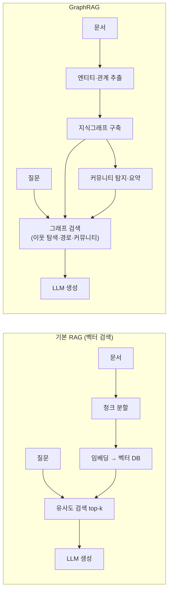
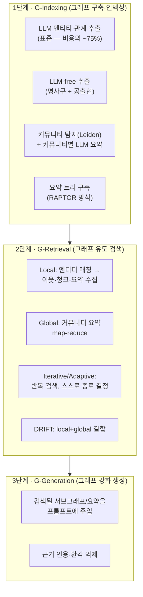
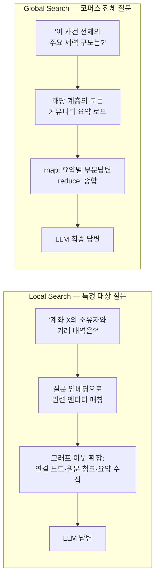
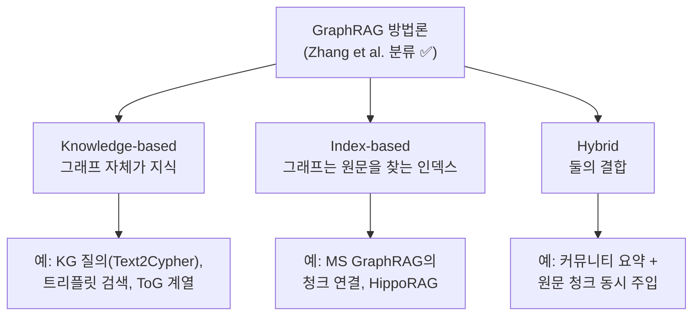
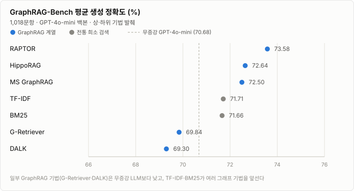
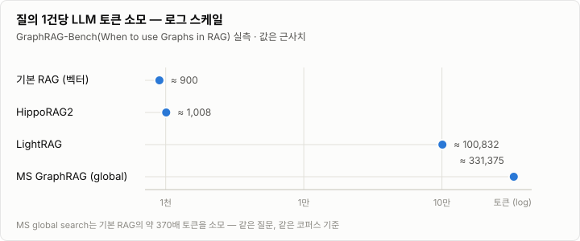
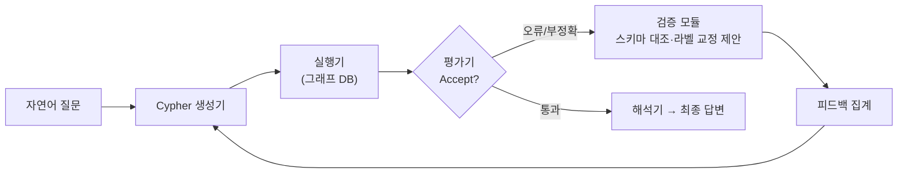
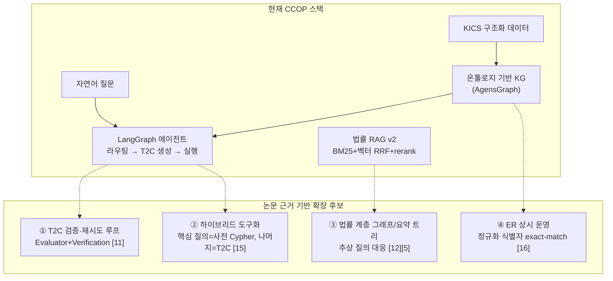

# GraphRAG 최신 연구 동향 리포트 (2024–2026)

> **작성일**: 2026-07-28 · **작성 방법**: 웹 딥리서치(소스 21개 → 검증 가능한 주장 94건 추출 → 3중 적대적 교차검증) 결과를 종합
>
> **신뢰도 표기**
> - ✅ **검증됨** — 독립 검증 3표 모두 통과(3-0)
> - 표기 없음 — 1차 출처(논문/공식 문서)에서 원문 인용을 확보했으나 교차검증은 생략됨
> - 블로그 출처 수치는 본문에 "블로그 실측"으로 명시
>
> 출처 번호 [n]은 문서 맨 아래 [출처 목록](#10-출처-목록)과 대응합니다.

---

## 목차

1. [배경: RAG는 무엇이고, 왜 GraphRAG가 나왔나](#1-배경-rag는-무엇이고-왜-graphrag가-나왔나)
2. [GraphRAG 파이프라인 3단계 해부](#2-graphrag-파이프라인-3단계-해부)
3. [연구 지형: 꼭 알아야 할 논문들](#3-연구-지형-꼭-알아야-할-논문들)
4. [주요 프레임워크 비교](#4-주요-프레임워크-비교)
5. [벤치마크 실측: 언제 이기고, 언제 지는가](#5-벤치마크-실측-언제-이기고-언제-지는가)
6. [2025→2026 기술 트렌드](#6-20252026-기술-트렌드)
7. [CCOP 적용 시사점 (수사·법률 KG + Text2Cypher)](#7-ccop-적용-시사점-수사법률-kg--text2cypher)
8. [이 보고서의 한계](#8-이-보고서의-한계)
9. [용어집](#9-용어집)
10. [출처 목록](#10-출처-목록)

---

## 한눈에 보기

| 질문 | 답 |
|------|-----|
| GraphRAG가 항상 RAG보다 좋은가? | **아니다.** 단순 사실 질문은 기본 RAG·BM25가 동급 이상. 이득은 **멀티홉 추론·추상 요약**에 집중 (멀티홉 +27.23점 vs 일반 +0.47점) [8] |
| 가장 큰 비용은 어디서 나오나? | **그래프 구축.** 전체 인덱싱 비용의 ~75%가 LLM 엔티티/관계 추출 [9]. 질의 비용도 MS global search는 기본 RAG의 210배 ✅ [4] |
| 요즘 트렌드는? | ① 구축·질의 **경량화**(LightRAG, FastGraphRAG, LinearRAG) ② 질의 유형별 **하이브리드 라우팅** ③ 정적 인덱스 → **agentic 동적 구축·검증 루프**(ToG-3, 멀티에이전트 T2C) |
| CCOP에 주는 의미는? | 이미 온톨로지 KG + Text2Cypher 보유 = **가장 비싼 병목이 없음**. 다음 스텝은 T2C **검증·재시도 루프**(+6.8~10.2%p 실증) [11] |

---

## 1. 배경: RAG는 무엇이고, 왜 GraphRAG가 나왔나

### 1.1 쉬운 비유로 시작하기

- **기본 RAG(벡터 검색)** 는 "잘 정리된 도서관 사서"입니다. 질문과 **비슷한 내용의 문서 조각(청크)** 을 찾아 LLM에게 건네줍니다. "이 조문이 뭐라고 쓰여 있지?" 같은 **한 곳만 찾으면 되는 질문**에 강합니다.
- **GraphRAG** 는 "화이트보드에 관계도를 그려놓은 수사관"입니다. 문서를 **개체(사람·계좌·전화·조직)와 관계(소유·이체·통화)의 그래프**로 만들어 두고, 질문이 오면 그래프의 **연결을 따라가며** 답을 조립합니다. "A와 C는 어떻게 연결되지?" 같은 **여러 정보를 이어 붙여야 하는 질문(멀티홉)** 에 강합니다.

### 1.2 기본 RAG의 3대 한계 ✅

홍콩폴리텍대 서베이 [3]는 평면 텍스트 검색 기반 RAG의 한계를 세 가지로 규정합니다:

1. **전문 도메인의 복잡한 질의 이해** 부족
2. **분산된 소스에 흩어진 지식의 통합** 어려움
3. **대규모 확장 시 효율 병목**

GraphRAG는 이를 ① 엔티티 관계·도메인 계층을 명시적으로 담는 **그래프 구조 지식 표현**, ② 멀티홉 추론이 가능한 **맥락 보존형 그래프 검색**, ③ **구조 인지(structure-aware) 지식 통합**으로 해결한다고 주장합니다 ✅ [3].

### 1.3 두 방식의 파이프라인 비교

핵심 차이는 **인덱스의 형태**입니다. RAG의 인덱스는 "비슷한 것끼리 가까운 벡터 공간"이고, GraphRAG의 인덱스는 "무엇이 무엇과 연결됐는지의 그래프"입니다. 그래서 GraphRAG는 **연결을 묻는 질문**에 강하고, 그 인덱스를 만드는 데 **훨씬 큰 비용**이 듭니다.

> 💡 **중요한 관점 하나** — Han et al. 서베이 [2]는 "RAG는 어떤 도메인이든 임베딩 공간 하나로 균일하게 설계할 수 있지만, **GraphRAG는 도메인마다 그래프의 형태·관계 패턴이 달라 균일 설계가 불가능하다**"고 지적합니다 ✅. 수사 그래프(계좌-이체-전화)와 법률 그래프(조문-판례-해석례)는 서로 다른 설계가 필요하다는 뜻이며, 이 보고서 7장의 전제가 됩니다.

---

## 2. GraphRAG 파이프라인 3단계 해부

기준 서베이(Peng et al., ACM TOIS) [1]는 GraphRAG 워크플로우를 3단계로 정형화했습니다 ✅:

### 2.1 G-Indexing — 그래프를 만드는 단계 (비용의 심장부)

**표준 방식 (Microsoft GraphRAG)** [9][16]:
1. 문서를 텍스트 유닛으로 쪼갠다
2. 각 유닛마다 **LLM이 엔티티(이름+설명)와 관계(설명 포함)를 추출**한다
3. **Leiden 커뮤니티 탐지** 알고리즘으로 그래프를 계층적 군집으로 나눈다
4. 군집(커뮤니티)마다 **LLM이 자연어 요약 리포트**를 생성한다

> ⚠️ Microsoft 공식 문서가 인정하는 사실: **엔티티/관계 추출 단계만 전체 인덱싱 비용의 약 75%** [9]. 이것이 GraphRAG 비용 문제의 근원입니다.

**경량 대안들**:

| 방식 | 아이디어 | 트레이드오프 |
|------|---------|-------------|
| FastGraphRAG [9] | LLM 대신 NLTK/spaCy 명사구 추출 + 공출현(co-occurrence) 관계 | 훨씬 저렴하지만 그래프가 노이지하고, 그래프 자체를 다른 용도(Text2Cypher 등)로 재사용하기 어려움 |
| LightRAG (블로그 실측 [18]) | 듀얼 레벨 인덱스, 500페이지 기준 ≈3분/$0.50 (MS는 ≈45분/$50–200) | 품질은 MS의 70–90% 수준 주장 |
| 온톨로지 유도 추출 (OMD-GraphRAG [13]) | **사전 정의 스키마(온톨로지)로 LLM 추출을 유도** → 정밀도 향상 | 스키마 설계 비용 — 이미 온톨로지가 있다면 공짜 |
| 요약 트리 (RAPTOR [5]) | 그래프 대신 재귀 클러스터링+요약으로 계층 트리 구축 | 구축 토큰 최소(MS의 1/8), 대신 구축 시간 최장 |

**알려진 구멍 — 엔티티 해소(ER) 부재**: MS GraphRAG에는 동일 실체 판정 단계가 없어 `Scrooge`와 `Ebenezer Scrooge`가 **별도 노드로 남습니다** [16]. 인물·계좌 동일성이 핵심인 도메인에서는 별도 ER 파이프라인이 필수입니다.

### 2.2 G-Retrieval — 그래프에서 꺼내오는 단계

서베이 [1]의 검색 패러다임 분류 ✅:

- **Once(단발)**: 한 번의 질의로 관련 정보를 모두 가져옴
- **Iterative(반복)**: 여러 번 검색. **Adaptive** 변형은 "언제 멈출지"를 모델이 스스로 결정
- **Multi-stage(다단계)**: 검색을 선형 단계로 나눔 (예: 엔티티 찾기 → 경로 확장 → 재랭킹)

검색 단위(granularity)는 **노드 / 트리플릿 / 경로 / 서브그래프** 네 층위 ✅ [1].

실무에서 가장 많이 쓰는 두 모드 [16]:

- **Local**은 벡터 검색으로 진입점 엔티티를 찾고 그래프를 따라 컨텍스트를 모읍니다 — 비용 온건.
- **Global**은 커뮤니티 요약 **전부**를 map-reduce로 순회합니다 — 커뮤니티 수에 비례해 LLM 호출·토큰이 폭증합니다 [16]. 완화 기법으로 **Dynamic Community Selection**(토큰 −79%, 블로그 실측 [18])과 local+global 결합형 **DRIFT search**(복합 질의 비용 −40~60%, 블로그 실측 [18])가 나왔습니다.
- Global search 패턴은 **질의 시점에 벡터 검색이 전혀 필요 없고 순수 Cypher로 구현 가능**하다는 점이 Neo4j 패턴 카탈로그에 문서화되어 있습니다 [16] — Cypher 기반 스택(AgensGraph 포함)에 직접 이식 가능한 근거.

### 2.3 G-Generation — 답을 만드는 단계

검색된 서브그래프·요약·원문 청크를 프롬프트에 조립해 LLM이 답합니다. 벤치마크의 반복 관찰 [5]: GraphRAG의 이득은 **최종 정답 정확도(+3%p 미만)보다 추론 근거(rationale) 품질(전 기법 향상)** 에서 큽니다. 즉 "정답을 더 맞히게" 하기보다 "**근거를 갖고 답하게**" 만드는 기술입니다 — 환각 억제가 중요한 도메인에서 가치가 큰 이유.

---

## 3. 연구 지형: 꼭 알아야 할 논문들

### 3.1 서베이 3편 (이론 지도)

| 서베이 | 무엇을 정립했나 |
|--------|----------------|
| **Peng et al. 2024** [1] — 최초 종합 서베이 ✅, ACM TOIS 게재 | G-Indexing → G-Retrieval → G-Generation 3단계 워크플로우 ✅ · 검색 패러다임(once/iterative/multi-stage)·granularity 분류 ✅ |
| **Han et al. 2025** [2] | 5컴포넌트 분해(query processor / retriever / organizer / generator / data source) ✅ · **도메인별 설계 필수** 논지 ✅ · 도메인별로 장을 나눠 기법 정리 |
| **Zhang et al. (PolyU) 2025** [3] | 그래프 **활용 방식** 기준 3분류 ✅: Knowledge-based(그래프=지식 운반체) / Index-based(그래프=원문 인덱스) / Hybrid |

> 📌 **CCOP의 위치**: KICS 그래프를 Cypher로 직접 질의하는 현재 구조는 **Knowledge-based**에 해당합니다. 법률 RAG처럼 원문(조문·판례)을 돌려줘야 하는 기능은 **Index-based** 성격이므로, 플랫폼 전체로는 Hybrid 전략이 자연스럽습니다.

### 3.2 실측 비교·벤치마크 (현실 검증)

- **Zhou et al., PVLDB 2025** [4] ✅ — 12개 기법을 **재구현**해 11개 QA 데이터셋에서 비교. 검색을 19개 모듈형 연산자(노드/관계/청크/서브그래프/커뮤니티)로 분해. 오픈소스 테스트베드 공개(github.com/JayLZhou/GraphRAG)
- **RAG vs GraphRAG 체계 평가** [7] — "일관된 승자 없음, 상호보완적"
- **GraphRAG-Bench 2편** [5][6] — 파이프라인 전체(구축→검색→생성→근거)를 난이도별로 평가
- **에이전틱 서치 vs GraphRAG** [8] — 2026년 시점의 "GraphRAG가 여전히 필요한가?" 질문에 대한 실측 답변

### 3.3 2026년 동향 (활발히 진행 중)

Awesome-GraphRAG 큐레이션 [17] 기준: **LinearRAG**(효율화, ICLR'26), **MemGraphRAG**(메모리 강화, KDD'26), **ProbeRAG/BAPO**(ACL'26), 그리고 법률 특화 **LegalGraphRAG**(ACL'26) [12]. 분야의 무게중심이 "새 아키텍처 제안"에서 **효율·신뢰성·도메인 특화**로 이동하는 흐름입니다.

---

## 4. 주요 프레임워크 비교

| 프레임워크 | 핵심 아이디어 | 강점 | 약점/비고 |
|-----------|--------------|------|----------|
| **Microsoft GraphRAG** | LLM 추출 KG + Leiden 커뮤니티 요약, local/global/DRIFT 검색 | 추상·요약 질의 품질 최상급 [4][6] | 구축·질의 비용 최고 ✅ [4] · ER 없음 [16] · 산출물(parquet)은 Neo4j 임포트 가능 [16] |
| **LightRAG** | 경량 듀얼 레벨 인덱스 | 비용 대비 품질 균형(블로그 실측: 1/100 비용에 70–90% 품질 [18]) | 구축 토큰은 의외로 최다 그룹(83.9M) [5] |
| **HippoRAG / 2** | 해마 기억 이론(PPR 기반 연상 검색) | 질의당 ~1K 토큰 — MS global의 1/300 [6] · 멀티홉 강함 [7] | 인덱싱 시간 김 [5] |
| **RAPTOR** | 그래프가 아닌 **재귀 요약 트리** | 사실형 QA 1위(73.58%) [5] · 검색 지연 0.02s [5] · 구축 토큰 최소 | 구축 시간 최장(≈20,396s) [5] · "그래프 없는 대조군"으로 항상 등장 |
| **FastGraphRAG** | LLM-free 추출(명사구+공출현) | 인덱싱 비용 급감 [9] | 그래프 노이즈·재사용성 낮음 [9] |
| **nano-graphrag** | 최소 구현체 | 학습·해킹 용이 [17] | 프로덕션용 아님 |
| **ToG-3** | 추론 중 동적 그래프 구축(MACER)·쿼리/서브그래프 동시 진화 | 고품질 KG 사전 구축 의존 탈피 [10] | agentic 오버헤드 |
| **Neo4j 계열** | GraphRAG 패턴 카탈로그·Text2Cypher retriever·**Graphiti**(시간 인지 에이전트 메모리 — 문서 QA용 아님 [18]) | Cypher 스택 이식성 근거 [16] | — |

> 그림으로 기억하기: **품질이 최우선이면 MS GraphRAG(global)**, **비용이 최우선이면 HippoRAG2·RAPTOR**, **균형이면 LightRAG + 하이브리드 라우팅** — 이것이 2025~26 실측 문헌의 공통 결론에 가장 가깝습니다 [4][5][6][7].

---

## 5. 벤치마크 실측: 언제 이기고, 언제 지는가

### 5.1 이길 때 — 멀티홉·추상 질의

- 단발 검색 기준 **멀티홉 QA에서 dense RAG 대비 평균 +27.23점**(Contain-EM; HotpotQA·2Wiki·MuSiQue), 반면 **일반 사실형 QA에서는 +0.47점** [8] — 그래프의 가치는 "여러 증거를 이어 붙이는 문제"에 집중
- 추상·주제형 QA(4.77M 토큰 **법률 코퍼스** 포함, GPT-4o 심판)에서 **MS global search가 포괄성/다양성 전 지표 1위**, RAPTOR 2위 [4] — 고수준 커뮤니티 요약이 추상 질문에 필수적
- 맥락 요약 태스크: MS-GraphRAG 64.40% vs 기본 RAG 51.30% [6]

### 5.2 질 때 — 단순 사실 질의

| 기법 | 평균 생성 정확도(%) | 비고 |
|------|-----------------|------|
| RAPTOR | 73.58 | 1위 — 요약 "트리"(그래프 아님) |
| HippoRAG | 72.64 | |
| MS GraphRAG | 72.50 | |
| TF-IDF / BM25 | 71.71 / 71.66 | **전통 희소 검색이 다수 그래프 기법을 앞섬** |
| 무증강 GPT-4o-mini | 70.68 | 기준선 |
| G-Retriever / DALK | 69.84 / 69.30 | **기준선보다 낮음** — 구조 정보 과의존 노이즈 |

(출처: GraphRAG-Bench, 1,018문항 [5])

- 소설 코퍼스 사실검색: rerank 붙인 기본 RAG 60.92% vs MS-GraphRAG 49.29% [6]
- 수학 도메인: 평가된 **모든** GraphRAG 기법이 무증강 LLM보다 성능을 깎아먹음 [5]
- 원인 진단 [7]: LLM 추출 KG의 정답 엔티티 커버리지가 **~65%뿐** → 트리플릿-only 검색은 성능 상한이 낮고, 관련 없는 그래프 요소가 노이즈로 유입

### 5.3 비용 — 가장 자주 과소평가되는 축

| 항목 | 실측치 | 출처 |
|------|--------|------|
| MS global search 질의 비용 | 기본 RAG 대비 **57× 시간, 210× 토큰** (쿼리당 ≈9분, ≈300K 토큰) — "실서비스 비실용" | ✅ [4] |
| 질의당 토큰 | 기본 RAG ≈900 · HippoRAG2 ≈1,008 · LightRAG ≈100,832 · MS global ≈331,375 | [6] |
| 인덱스 구축 시간 | RAG 135초 vs Community-GraphRAG 5,560초 vs KG-GraphRAG 7,702초 (**41~57×**) | [7] |
| 구축 토큰 | LightRAG 83.9M · MS 79.9M vs RAPTOR 10.1M (**~8× 격차**) | [5] |
| 검색 지연 | RAPTOR 0.02s ~ KGP 89.38s (**수천 배 편차**) | [5] |
| 인덱싱 단가 | MS 방식: 1M 토큰당 1.72h / $13.19 | [8] |
| 운영 부담 | 코퍼스 갱신 시 재추출·ER 대사·커뮤니티 재계산 — 증분 갱신이 실운영 최대 이슈 | 블로그 [18] |

### 5.4 환각(hallucination) — 양면성

- **줄여주는 면**: 근거 품질(rationale) 점수는 9개 기법 전부 향상(55.45 → 최고 60.90) — 명시적 근거에 답을 접지 [5]
- **키우는 면**: global search는 "정보 없음"으로 답해야 할 Null 질의에서 붕괴(F1 19.27 vs RAG 96.01) — **요약만 보고 답을 지어냄** [7]

### 5.5 agentic search 시대에도 GraphRAG가 필요한가? (2026)

2026년 논문 [8]의 실측 답변:
- 에이전틱 서치(다회 검색·RL 학습형)는 dense RAG를 크게 끌어올려 격차를 좁히지만, **복잡한 멀티홉에서는 GraphRAG 우위 유지**(HotpotQA 격차 +27.70 → agentic 하 +8.99)
- agentic 추론에서 GraphRAG는 **더 안정적**(문서 적중률 높고 답변 분산 낮음: 33.65±1.03 vs 42.36±0.22)
- 백본을 3B→7B로 키우면 양쪽 다 좋아지되 **격차는 줄어듦**
- 저자 결론: agentic search는 "구조가 만들어지는 위치를 오프라인 그래프 구축에서 **온라인 상호작용으로 재배치**할 뿐, 대체하지 않는다"

---

## 6. 2025→2026 기술 트렌드

### 6.1 정적 인덱스 → 동적·agentic 구축

**ToG-3** [10]: 기존 GraphRAG의 근본 한계를 "고품질 KG 사전 구축 의존"으로 지목 — 수동 구축은 확장이 안 되고, LLM 자동 추출은 (특히 소형 로컬 모델에서) 품질이 제한됨. 해법으로 **MACER**(Multi-Agent Context Evolution and Retrieval): Chunk-Triplets-Community 3계층 이종 그래프를 **추론 중에 동적으로 구축·정제**하고, **Dual-Evolution**으로 쿼리와 서브그래프를 동시에 진화시킴.

### 6.2 Text2Cypher × GraphRAG의 합류 — LPG 진영의 부상

- 대부분의 GraphRAG 연구가 RDF+SPARQL을 겨냥해 왔고 **Cypher/LPG(레이블드 프로퍼티 그래프)는 미개척**이라는 문제의식 [11]
- **Multi-Agent GraphRAG** [11]: 8컴포넌트 에이전트 파이프라인 — Query Generator → Executor → **Evaluator**(Accept/Incorrect/Error 판정) → NE Extractor → **Verification**(환각 라벨·프로퍼티를 Levenshtein 거리로 교정 제안) → Instructions Generator → Feedback Aggregator → Interpreter

- CypherBench 결과: 단발 생성 대비 **모든 백본에서 +6.8~10.2%p** — GPT-4o 56.07→62.86%, Gemini 2.5 Pro 67.00→77.23%, Qwen3 Coder 45.73→53.40% [11]
- 남은 실패 유형: 분리(disjunction)·대칭 관계·다중 의도 질문 [11]
- **Neo4j Text2Cypher (2024) 벤치마크** [14]: 14개 모델 평가, 최고 모델(GPT-4o·파인튜닝 모델)도 실행 기반 ExactMatch **~30%** — T2C는 여전히 어려운 과제이며, 파인튜닝으로 개선 가능함을 입증 (평가 방법론: 번역 기반 BLEU / 실행 기반 ExactMatch 이원화)

### 6.3 도메인 특화 — 법률 GraphRAG의 등장

**LegalGraphRAG** (ACL 2026) [12]:
- 문제의식: 평면 KG는 **사실적 세부사항(판례) ↔ 적용 규칙(조문) ↔ 추상 원리(해석)** 의 추상화 수준을 구분하지 못함
- 해법 ①: 추상화 수준별로 검색 가능한 **계층형 법률 그래프**
- 해법 ②: **Researcher(후보 증거 검색) → Auditor(원문 대조 검증) → Adjudicator(검증된 증거만 종합)** 3역할 에이전트 — "검색 결과를 검증 없이 LLM에 넘기는" 전통 RAG의 불투명 추론을 명시적 검증 단계로 보완
- 코드·데이터셋 공개(github.com/XMUDeepLIT/LegalGraphRAG)

### 6.4 수사 도메인 레퍼런스 — Neo4j KYC 에이전트 (2025-08) [15]

금융범죄(KYC/AML) 수사 에이전트 데모의 설계 패턴:
- **하이브리드 도구 구성**: 핵심 수사 질의(예: 6홉까지 순환 송금 고리 탐지 `find_customer_rings`)는 **사전 작성 Cypher 도구**로, 임의 질문만 **동적 T2C**(스키마 조회 → 생성 → 실행 → 오류 시 재생성)로 fallback
- T2C는 **파인튜닝된 Gemma3-4B 로컬 모델**(Ollama 구동)로 처리 — 4B급 로컬 모델로 스키마 인지 T2C가 가능함을 실증
- 저자가 명시한 경고: 동적 T2C는 "bulletproof가 아니다" — 반복 질의는 명시적 도구화, 사용자 피드백, 가드레일 권고
- **수사 결과를 그래프에 축적**: 수사 요약을 Memory 노드로 만들어 관련 고객/계좌/거래에 링크(append-only) → 팀 공유 수사 지식베이스

---

## 7. CCOP 적용 시사점 (수사·법률 KG + Text2Cypher)

### 7.1 현재 위치 — 이미 유리한 지점에 서 있다

GraphRAG 비용의 심장부(1단계 G-Indexing, 비용의 ~75% [9])가 CCOP에는 **사실상 없습니다**. KICS 구조화 데이터 + 온톨로지 스키마로 그래프를 만들기 때문입니다. 이는 OMD-GraphRAG [13]가 제안하는 "온톨로지 유도 추출"의 이상형에 이미 가 있는 상태이고, Han et al. ✅ [2]의 "도메인별 설계 필수" 논지와도 부합합니다.

### 7.2 우선순위 제안

| 순위 | 항목 | 근거 | 기대 효과 |
|------|------|------|----------|
| **P1** | **T2C 검증 루프 보강** — 에이전트에 **이미 있는** 스키마 화이트리스트 사전검증(`_validate_cypher_schema`)과 reflection 재시도 루프 위에: ① 실행 '성공' 결과의 의미 정합성 판정(Evaluator — 현재는 에러·0건만 재시도 트리거, 결과가 나오면 무조건 성공 간주), ② 검증 실패 라벨의 근사 교정 제안(Levenshtein [11] — 현재는 "유효 라벨에서 선택" 메시지만), ③ 재시도 예산 설정화(현재 기본 1회) | 모든 백본 +6.8~10.2%p 실증 [11] · 최고 모델도 ExactMatch ~30%라는 T2C 난이도 [14] · **현 구조(생성→실행→성찰 루프)가 이미 [11]의 골격과 일치** | v42(86.6%) 이후 모델 교체 없이 정확도 상승 여지. 실패 유형(다중 의도·대칭 관계 [11])은 라우팅 단계 분해로 보완 |
| **P2** | **하이브리드 도구화** — **기존 범죄 패턴 라이브러리**(`pattern_library.py`, Cypher 템플릿 8종 — 현재 별도 분석 API로만 노출되고 T2C 에이전트와는 미연결)를 에이전트의 사전 검증 도구로 승격하고, 자금 고리·공범 네트워크 등 고빈도 수사 질의로 확장. T2C는 fallback | Neo4j KYC 패턴 [15] — "동적 T2C는 bulletproof가 아니다" | 고빈도 질의의 신뢰성 100% 고정, 기존 자산 재사용으로 신규 개발 최소화 + 4B 로컬 T2C 실증은 폐쇄망 sLLM 전략과 부합 |
| **P3** | **법률 RAG 확장** — 추상 질의("이런 유형 판례 경향은?") 요구가 생기면: 1안 RAPTOR식 요약 트리(가성비 [5]), 2안 조문-판례-해석 계층 그래프 + Auditor 검증 에이전트 [12] | 사실형은 현 BM25+벡터 RRF로 충분 (사실형 QA에서 희소 검색이 강함 [5]) | 전면 GraphRAG 전환 없이 추상 질의만 계층 요약으로 대응 |
| **P4** | **ER 상시 운영** — 정규화 식별자(전화·계좌·IP·URL·해시·계정) exact-match 기반 sameAs 브릿지 유지·확장, 인물/조직 fuzzy는 검토(pending) 유지 | 주류 프레임워크(MS)조차 ER 부재가 알려진 한계 [16] | OSINT↔수사 그래프 융합의 전제조건. 기존 `osint_entity_resolution.py` 방향이 표준 대비 결핍이 아니라 **필수 보완**임을 확인 |

> ※ **2026-07-28 코드 대조 검증 반영**: P1·P2는 실제 구현 현황(`langgraph_agent.py`의 스키마 검증·reflection 루프, `pattern_library.py` 8종)에 맞춰 정정된 서술이다. P3(BM25+벡터 RRF+rerank, 요약 계층 부재)·P4(exact-match sameAs 초안, fuzzy 스텁) 서술은 코드와 일치함을 확인했다.

### 7.3 피해야 할 것

1. **MS global search식 전 커뮤니티 map-reduce 직도입** — 쿼리당 ≈300K 토큰 ✅ [4]은 폐쇄망 sLLM에서 비현실적. 도입 시 Dynamic Community Selection·DRIFT [18] 같은 완화 기법이 전제
2. **"그래프에 다 있으니 원문은 버려도 된다"는 가정** — 원문 청크를 유지하지 않은 그래프-only 기법들이 기본 RAG에도 밀린 것이 반복 관찰됨 [4][5]
3. **Null 질의 무방비** — 근거가 없으면 "정보 없음"으로 답하게 하는 가드(요약 기반 검색일수록 환각 위험 [7])
4. **비용 검증 없는 커뮤니티 요약 파이프라인** — 수사 데이터는 계속 갱신되므로 증분 재계산 부담 [18]을 먼저 산정할 것

---

## 8. 이 보고서의 한계

- 3중 교차검증을 통과한 주장은 ✅ 9건이며, 나머지는 1차 출처 원문 인용까지만 확보된 상태입니다(세션 한도로 검증 단계 일부 미완). 수치를 의사결정에 쓸 때는 해당 논문 원문 확인을 권장합니다.
- 벤치마크 수치는 **평가 조건(백본 모델·코퍼스·지표)에 강하게 종속**됩니다. 서로 다른 논문의 수치를 직접 비교하지 마시고, 같은 표 안의 상대 비교로만 읽어 주세요.
- 블로그 출처([18][19])의 비용 수치는 학술 검증을 거치지 않은 실무 실측입니다.
- 검증 단계에서 반박(1-2)되어 **제외**한 주장 1건: "PolyU 서베이가 MS GraphRAG를 foundational로 규정하고 파생 생태계를 나열한다"는 세부 주장.

## 9. 용어집

| 용어 | 쉬운 설명 |
|------|----------|
| **RAG** | 검색 증강 생성. LLM이 답하기 전에 외부 자료를 검색해 프롬프트에 넣어주는 기법 |
| **멀티홉(multi-hop)** | "A→B→C"처럼 **여러 정보를 이어 붙여야** 답이 나오는 질문. 예: "피해자 계좌에서 돈을 받은 사람의 다른 전화번호는?" |
| **엔티티/관계 추출** | 텍스트에서 개체(인물·계좌…)와 그들 사이의 관계(소유·이체…)를 뽑아 그래프로 만드는 것 |
| **커뮤니티 탐지 (Leiden)** | 그래프에서 서로 밀접하게 연결된 노드 군집을 찾는 알고리즘. 군집마다 LLM 요약을 만들어두면 "전체 구도" 질문에 답할 수 있음 |
| **Local / Global search** | Local = 특정 엔티티 주변만 탐색, Global = 커뮤니티 요약 전체를 순회해 코퍼스 수준 질문에 답변 |
| **PPR (Personalized PageRank)** | 시작 노드에서 가까운(연관 깊은) 노드에 높은 점수를 주는 그래프 알고리즘. HippoRAG의 핵심 |
| **LPG / RDF** | 그래프 데이터 모델 두 계열. LPG(Cypher — Neo4j·AgensGraph·Memgraph) vs RDF(SPARQL — 시맨틱 웹) |
| **Text2Cypher (T2C)** | 자연어 질문을 Cypher 그래프 질의로 번역하는 작업 |
| **엔티티 해소 (ER)** | 표기가 다른 두 노드('홍길동'/'길동 홍')가 같은 실체인지 판정해 병합·연결하는 작업 |
| **RRF (Reciprocal Rank Fusion)** | 여러 검색기의 순위를 융합하는 간단·강건한 방법 (법률 RAG v2에서 사용 중) |
| **Contain-EM / ExactMatch / F1** | QA 평가지표. 정답 포함 여부 / 완전 일치 / 부분 일치 균형 점수 |

## 10. 출처 목록

| # | 출처 | 유형 |
|---|------|------|
| [1] | Peng et al., *Graph Retrieval-Augmented Generation: A Survey* — https://arxiv.org/abs/2408.08921 (ACM TOIS) | 논문(서베이) |
| [2] | Han et al., *Retrieval-Augmented Generation with Graphs (GraphRAG)* — https://arxiv.org/abs/2501.00309 | 논문(서베이) |
| [3] | Zhang et al., *A Survey of Graph RAG for Customized LLMs* — https://arxiv.org/abs/2501.13958 | 논문(서베이) |
| [4] | Zhou et al., *In-depth Analysis of Graph-based RAG* — https://arxiv.org/pdf/2503.04338 (PVLDB 18(13), 2025) · 테스트베드 https://github.com/JayLZhou/GraphRAG | 논문(실측) |
| [5] | *GraphRAG-Bench: Challenging Domain-Specific Reasoning* — https://arxiv.org/pdf/2506.02404 | 논문(벤치마크) |
| [6] | *When to use Graphs in RAG* — https://arxiv.org/abs/2506.05690 (OpenReview i9q9xDMjG7) | 논문(벤치마크) |
| [7] | *RAG vs. GraphRAG: A Systematic Evaluation and Key Insights* — https://arxiv.org/html/2502.11371 | 논문(실측) |
| [8] | 단발/에이전틱 설정의 GraphRAG vs dense RAG 실측 비교 — https://arxiv.org/pdf/2604.09666 | 논문(실측) |
| [9] | Microsoft GraphRAG 공식 문서(인덱싱 방법) — https://microsoft.github.io/graphrag/index/methods/ | 공식 문서 |
| [10] | *ToG-3 (Think-on-Graph 3.0)* — https://arxiv.org/abs/2509.21710 | 논문 |
| [11] | *Multi-Agent GraphRAG: Text-to-Cypher over LPG* — https://arxiv.org/abs/2511.08274 | 논문 |
| [12] | *LegalGraphRAG* — https://arxiv.org/abs/2605.28120 (ACL 2026) · https://github.com/XMUDeepLIT/LegalGraphRAG | 논문(도메인) |
| [13] | *OMD-GraphRAG* — arXiv 2603.25152 | 논문 |
| [14] | Neo4j, *Benchmarking Neo4j Text2Cypher (2024) Dataset* — https://neo4j.com/blog/developer/benchmarking-neo4j-text2cypher-dataset/ | 벤더 기술 블로그 |
| [15] | Neo4j, *GraphRAG in Action: KYC 수사 에이전트* — https://neo4j.com/blog/developer/graphrag-in-action-know-your-customer/ | 벤더 기술 블로그 |
| [16] | Neo4j, *Microsoft GraphRAG × Neo4j 통합* — https://neo4j.com/blog/developer/microsoft-graphrag-neo4j/ | 벤더 기술 블로그 |
| [17] | DEEP-PolyU, *Awesome-GraphRAG* — https://github.com/DEEP-PolyU/Awesome-GraphRAG | 큐레이션 |
| [18] | paperclipped.de, *Graph RAG in Production (2026-03)* — https://www.paperclipped.de/en/blog/graph-rag-production/ | 블로그(실무 실측) |
| [19] | *RAG vs GraphRAG in 2025: A Builder's Field Guide* (Medium) | 블로그 |

---

*이 문서는 Claude Code 딥리서치 워크플로우 결과를 바탕으로 작성되었습니다. 차트 데이터의 원 수치는 각 표에 병기되어 있습니다.*
