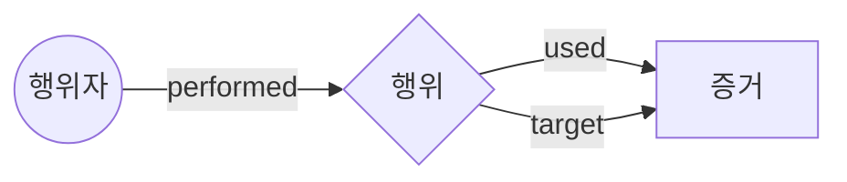

# [발표자료] 차세대 사이버 범죄 온톨로지 (KICS 4-Layer)

---

## 1. 개요 (Intro)

### The New Standard for Digital Investigation
경찰청 표준(KICS)과 글로벌 분석 표준(POLE)을 결합한 **차세대 하이브리드 온톨로지**를 소개합니다.

** 핵심 변화 **
- **Before**: 사건 중심의 단순 연결 (Star Schema)
- **After**: **행위(Action)** 중심의 시계열 추적 (4-Layer Model)

---

## 2. 문제 제기 (Why Change?)

### 기존 모델의 한계
"보이스피싱 조직원 A가 대포폰 B를 사용했다"는 알 수 있지만,
**"A가 언제 B를 이용해 누구에게 문자를 보내고, 그 직후에 이체를 실행했는지"** 순서를 파악하기 어렵습니다.

> **단순 연결(Static Link)만으로는 '범죄의 시나리오'를 재구성할 수 없습니다.**

---

## 3. 솔루션: 4-Layer 모델

우리는 데이터를 4가지 계층으로 구조화하여 범죄를 입체적으로 재구성합니다.

1. **CASE (맥락)**: "어떤 사건인가?" (수사 배경)
2. **ACTOR (주체)**: "누가 했는가?" (용의자, 조직)
3. **ACTION (행위)**: "**무엇을** 했는가?" (이체, 통화, 접속 - **Time**)
4. **EVIDENCE (객체)**: "어떤 도구를 썼는가?" (계좌, 전화, IP - **Object**)

> **핵심**: 모든 증거를 '행위(Action)'로 연결하여 **타임라인**을 자동으로 생성합니다.

---

## 4. 상세 아키텍처

### 16종 핵심 엔티티 구조

- **Actor**: Person, Organization, Device
- **Action**: Transfer, Call, Access, Message
- **Evidence**: BankAccount, Phone, NetworkTrace, WebTrace ...

---

## 5. 적용 예시 (Use Case)

### "자금세탁 경로 자동 추적"

수사관의 질문: **"이 계좌로 들어온 돈이 어디로 빠져나갔어?"**

**시스템의 분석 과정 (Automated Reasoning)**
1. `Transfer` 행위 노드를 시간순으로 정렬
2. `(입금계좌)-[:transferred_to]->(출금계좌)` 패턴 매칭
3. 3단계 이상의 이체 흐름(Chain) 탐지

**결과**: "용의자 김철수가 10:00에 받은 돈을, 10:05에 대포통장 B로 이체하고, 10:10에 해외 거래소로 송금했습니다."

---

## 6. 기대 효과 (Impact)

1. **수사 속도 향상**: 복잡한 거래 내역 분석 시간 90% 단축
2. **증거 능력 강화**: 데이터 출처(Provenance)와 시점(Timestamp) 명시로 법적 효력 확보
3. **확장성**: 마약, 도박 등 새로운 범죄 유형도 '행위'만 정의하면 즉시 적용 가능

---

## 7. Q&A

**"데이터는 KICS 표준을, 분석은 글로벌 표준을 따릅니다."**
